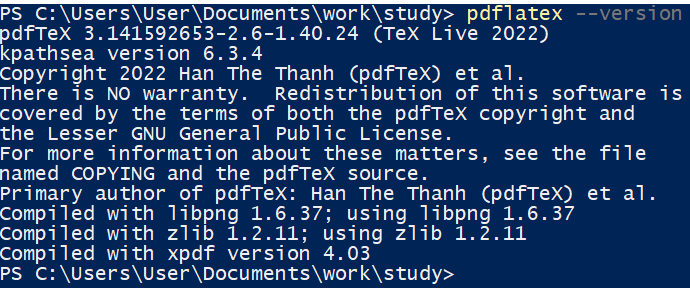
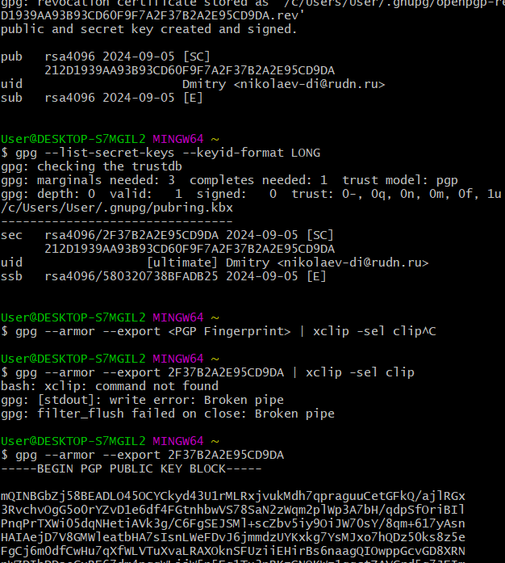
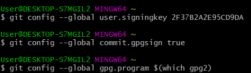
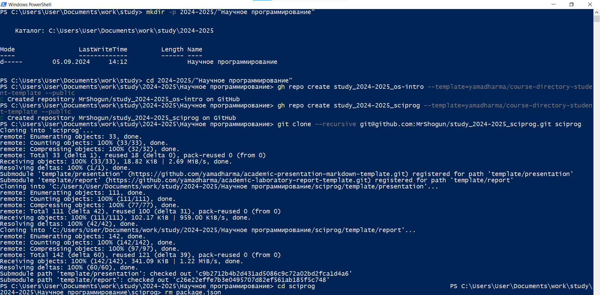
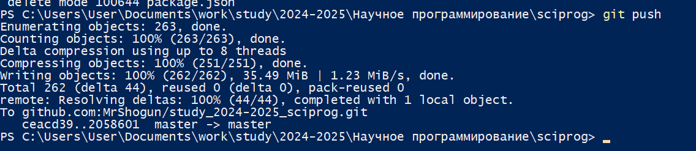
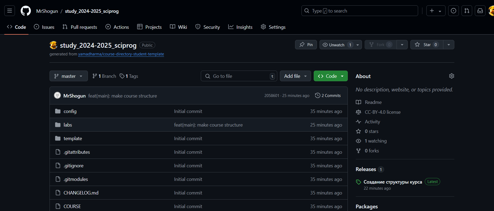

---
## Front matter
lang: ru-RU
title: Лабораторная работа №1
subtitle: Научное программирование
author:
  - Николаев Дмитрий Иванович, НПМмд-02-24
institute:
  - Российский университет дружбы народов имени Патриса Лумумбы, Москва, Россия
group:
  - НПМмд-02-24

## i18n babel
babel-lang: russian
babel-otherlangs: english

## Formatting pdf
toc: false
toc-title: Содержание
slide_level: 2
aspectratio: 169
section-titles: true
theme: metropolis
header-includes:
 - \metroset{progressbar=frametitle,sectionpage=progressbar,numbering=fraction}
 - '\makeatletter'
 - '\beamer@ignorenonframefalse'
 - '\makeatother'
---

# Прагматика выполнения

- Освоение Git для выполнения лабораторных работ.
- Первичная настройка конфигурации git
 
# Цель

Изучение идеологии и применения средств контроля версий. Освоение умений по работе с git.

# Задачи

1. Овладение инструментарием системы контроля версий git.
2. Настройка первичной конфигурации git.
3. Создание ключей SSH и PGP для подписи.
4. Создание рабочего пространства для дальнейшей работы.

# Выполнение работы

## Настройка git 1

{#fig:001 width=80%}

## Настройка git 2

{#fig:002 width=80%}

## Настройка git 3

{#fig:003 width=80%}

## Создание репозитория 1

{#fig:004 width=80%}

## Создание репозитория 2

{#fig:005 width=80%}

## Создание репозитория 3

{#fig:006 width=80%}

## Создание репозитория 4

{#fig:007 width=80%}

# Результаты

В ходе работы я освоил основные принципы и команды Git, а также совершил первичную настройку git с созданием ключей подписи.
