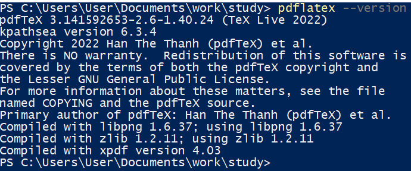
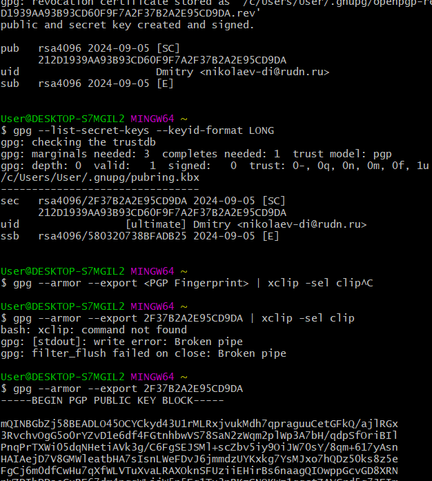
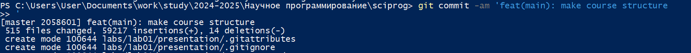
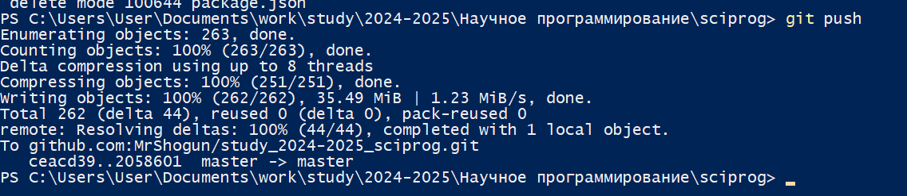
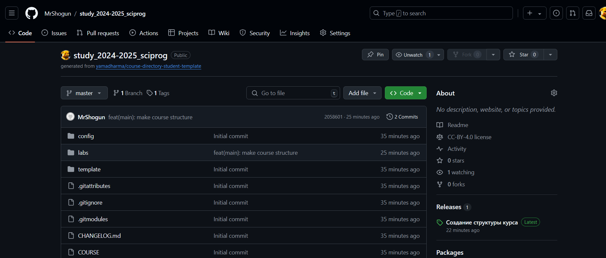

---
## Front matter
title: "Лабораторная работа №1"
subtitle: "Научное программирование"
author: "Николаев Дмитрий Иванович"

## Generic otions
lang: ru-RU
toc-title: "Содержание"

## Bibliography
bibliography: bib/cite.bib
csl: pandoc/csl/gost-r-7-0-5-2008-numeric.csl

## Pdf output format
toc: true # Table of contents
toc-depth: 2
lof: true # List of figures
lot: true # List of tables
fontsize: 12pt
linestretch: 1.5
papersize: a4
documentclass: scrreprt
## I18n polyglossia
polyglossia-lang:
  name: russian
  options:
	- spelling=modern
	- babelshorthands=true
polyglossia-otherlangs:
  name: english
## I18n babel
babel-lang: russian
babel-otherlangs: english
## Fonts
mainfont: PT Serif
romanfont: PT Serif
sansfont: PT Sans
monofont: PT Mono
mainfontoptions: Ligatures=TeX
romanfontoptions: Ligatures=TeX
sansfontoptions: Ligatures=TeX,Scale=MatchLowercase
monofontoptions: Scale=MatchLowercase,Scale=0.9
## Biblatex
biblatex: true
biblio-style: "gost-numeric"
biblatexoptions:
  - parentracker=true
  - backend=biber
  - hyperref=auto
  - language=auto
  - autolang=other*
  - citestyle=gost-numeric
## Pandoc-crossref LaTeX customization
figureTitle: "Рис."
tableTitle: "Таблица"
listingTitle: "Листинг"
lofTitle: "Список иллюстраций"
lotTitle: "Список таблиц"
lolTitle: "Листинги"
## Misc options
indent: true
header-includes:
  - \usepackage{indentfirst}
  - \usepackage{float} # keep figures where there are in the text
  - \floatplacement{figure}{H} # keep figures where there are in the text
---

# Цель работы

Изучить идеологию и применение средств контроля версий. Освоить умения по работе с git.

# Теоретическое введение

Git --- это система контроля версий, которая используется для отслеживания изменений в файлах и управления версиями программного обеспечения. Она позволяет разработчикам работать над одним проектом вместе, сохранять все изменения, откатываться к предыдущим версиям и легко находить ошибки.

Git работает на основе репозитория, который представляет собой хранилище всех версий файлов проекта. Каждый раз, когда разработчик делает изменения в файлах, он создает новую версию, которую называет коммитом. Коммит содержит информацию о том, какие файлы были изменены и кто сделал эти изменения.

# Ход работы

Следуем указаниям из [@lab1]. Создаем базовую конфигурацию для работы с git и создаём PGP ключ ([@fig:001-@fig:003]), так как SSH ключ уже имеется.

{#fig:001 width=80%}

{#fig:002 width=80%}

{#fig:003 width=80%}

Создание репозитория курса на основе шаблона ([@fig:004-@fig:006]), в результате чего, получаем следующий репозиторий ([@fig:007]).

{#fig:004 width=80%}

{#fig:005 width=80%}

{#fig:006 width=80%}

{#fig:007 width=80%}

# Выводы

В ходе выполнения лабораторной работы я освоил основные принципы и команды Git, а также совершил первичную настройку git с созданием ключей подписи.

# Список литературы{.unnumbered}

::: {#refs}
:::
