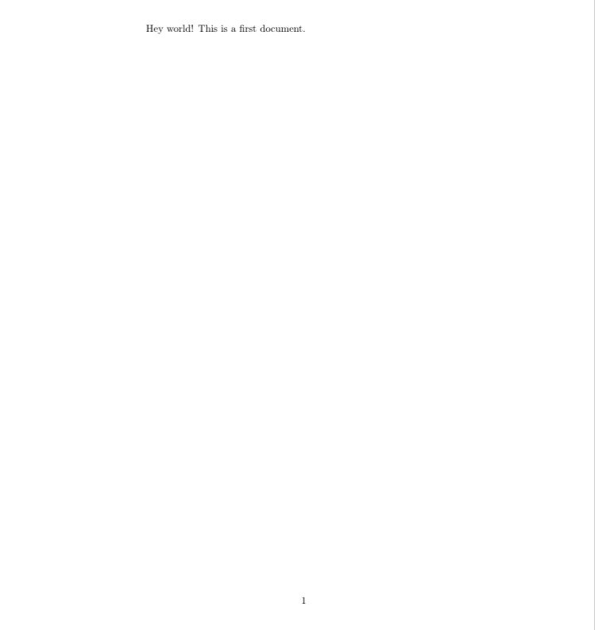
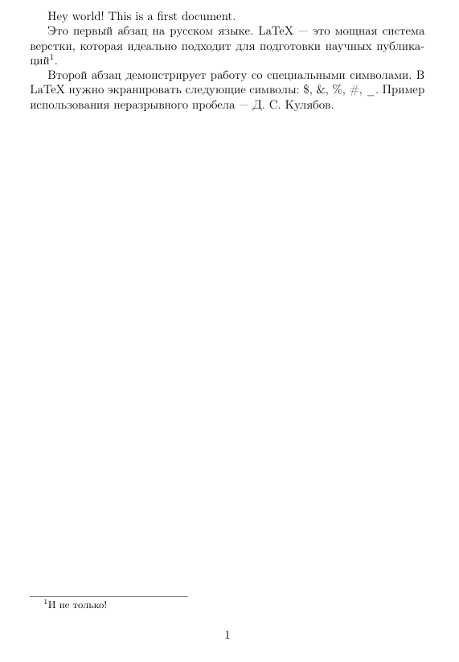

---
## Front matter
lang: ru-RU
title: Лабораторная работа №2
subtitle: Научное программирование
author:
  - Николаев Дмитрий Иванович, НПМмд-02-24
institute:
  - Российский университет дружбы народов имени Патриса Лумумбы, Москва, Россия
date: 5 сентября 2024

## i18n babel
babel-lang: russian
babel-otherlangs: english

## Formatting pdf
toc: false
toc-title: Содержание
slide_level: 2
aspectratio: 169
section-titles: true
theme: metropolis
header-includes:
 - \metroset{progressbar=frametitle,sectionpage=progressbar,numbering=fraction}
 - '\makeatletter'
 - '\beamer@ignorenonframefalse'
 - '\makeatother'
---

# Прагматика выполнения

- Получение знаний об особенностях легковесного языка разметки Markdown;
- Написание отчётов с помощью Markdown.

# Цели

Научиться оформлять отчёты с помощью легковесного языка разметки Markdown.

# Задачи

1. Освоить основы легковесного языка разметки Markdown;
2. Написание отчёта по лабораторной работе №1 в формате Markdown.

# Выполнение работы

## Отчёт лабораторной работы №1 в Markdown

{#fig:001 width=80%}

## Презентация лабораторной работы №1 в Markdown

{#fig:002 width=80%}

# Результаты

В ходе работы я освоил навыки написания отчётов лабораторных работ с помощью легковесного языка разметки Markdown.
