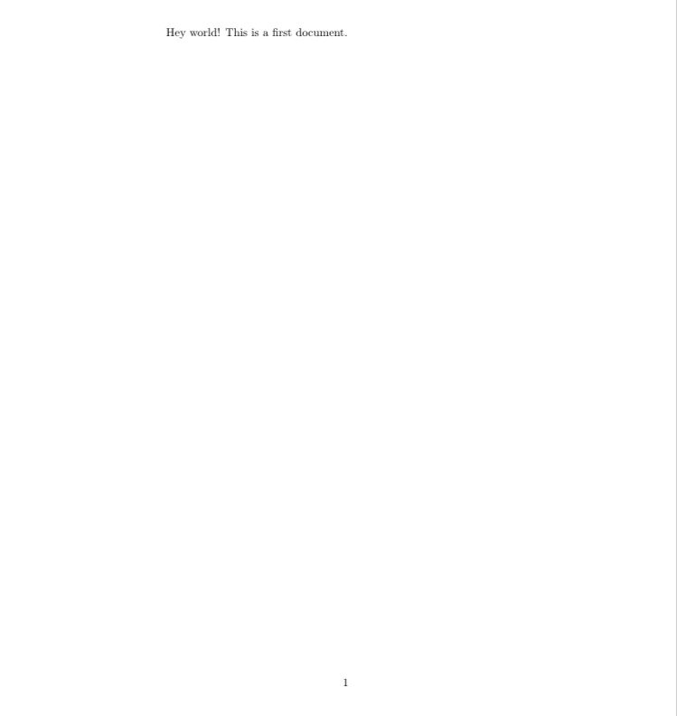
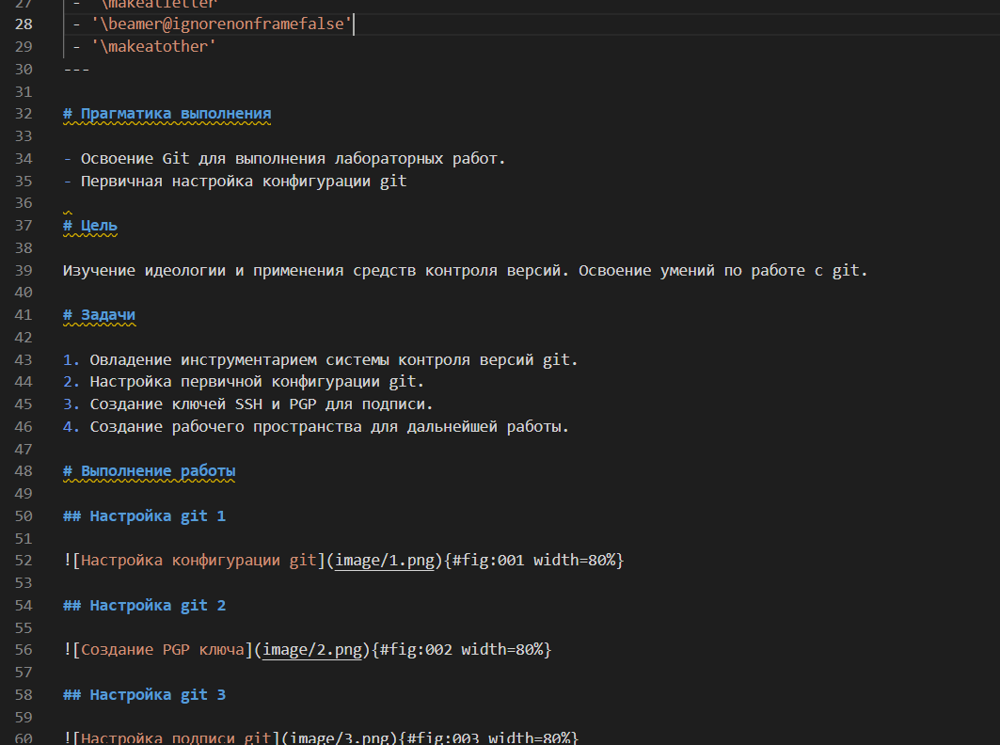

---
## Front matter
title: "Лабораторная работа №2"
subtitle: "Научное программирование"
author: "Николаев Дмитрий Иванович, НПМмд-02-24"

## Generic otions
lang: ru-RU
toc-title: "Содержание"

## Bibliography
bibliography: bib/cite.bib
csl: pandoc/csl/gost-r-7-0-5-2008-numeric.csl

## Pdf output format
toc: true # Table of contents
toc-depth: 2
lof: true # List of figures
lot: true # List of tables
fontsize: 12pt
linestretch: 1.5
papersize: a4
documentclass: scrreprt
## I18n polyglossia
polyglossia-lang:
  name: russian
  options:
	- spelling=modern
	- babelshorthands=true
polyglossia-otherlangs:
  name: english
## I18n babel
babel-lang: russian
babel-otherlangs: english
## Fonts
mainfont: PT Serif
romanfont: PT Serif
sansfont: PT Sans
monofont: PT Mono
mainfontoptions: Ligatures=TeX
romanfontoptions: Ligatures=TeX
sansfontoptions: Ligatures=TeX,Scale=MatchLowercase
monofontoptions: Scale=MatchLowercase,Scale=0.9
## Biblatex
biblatex: true
biblio-style: "gost-numeric"
biblatexoptions:
  - parentracker=true
  - backend=biber
  - hyperref=auto
  - language=auto
  - autolang=other*
  - citestyle=gost-numeric
## Pandoc-crossref LaTeX customization
figureTitle: "Рис."
tableTitle: "Таблица"
listingTitle: "Листинг"
lofTitle: "Список иллюстраций"
lotTitle: "Список таблиц"
lolTitle: "Листинги"
## Misc options
indent: true
header-includes:
  - \usepackage{indentfirst}
  - \usepackage{float} # keep figures where there are in the text
  - \floatplacement{figure}{H} # keep figures where there are in the text
---

# Цель работы

Научиться оформлять отчёты с помощью легковесного языка разметки Markdown.

# Теоретическое введение

Markdown --- это язык разметки, который используется для создания форматированного текста. Он был создан Джоном Грубером и Аароном Шварцем в 2004 году. Markdown позволяет создавать документы, которые легко читаются и редактируются, но при этом могут быть преобразованы в HTML для публикации в интернете.

Основная идея Markdown заключается в том, чтобы сделать процесс написания текста максимально простым и удобным. Вместо того чтобы использовать сложные теги HTML, пользователи могут просто добавлять специальные символы перед текстом, чтобы указать его формат.

Markdown также поддерживает создание ссылок, изображений, таблиц и других элементов, которые часто используются в документах. Кроме того, он может быть использован для создания блогов, статей, электронных книг и других типов контента.

# Выполнение лабораторной работы  

Выполняем задания согласно указаниям [@lab2].

Выполняем отчёт и презентацию по предыдущей лабораторной работе в формате Markdown([@fig:001-@fig:002]).

{#fig:001 width=80%}

{#fig:002 width=80%}

# Выводы

В ходе выполнения лабораторной работы я освоил написание отчёта лабораторной работы с помощью легковесного языка разметки Markdown.

# Список литературы{.unnumbered}

::: {#refs}
:::
