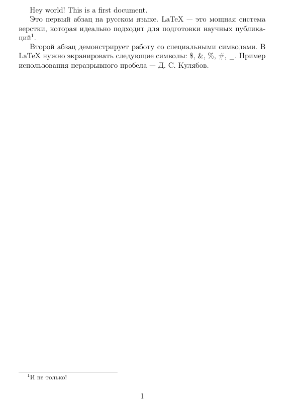

---
## Front matter
title: "Лабораторная работа №2: Создание первого документа в LaTeX"
subtitle: "Computer Skills for Scientific Writing"
author: "Николаев Дмитрий Иванович, НПМмд-02-24"

## Generic otions
lang: ru-RU
toc-title: "Содержание"

## Bibliography
bibliography: bib/cite.bib
csl: pandoc/csl/gost-r-7-0-5-2008-numeric.csl

## Pdf output format
toc: true # Table of contents
toc-depth: 2
lof: true # List of figures
lot: true # List of tables
fontsize: 12pt
linestretch: 1.5
papersize: a4
documentclass: scrreprt
## I18n polyglossia
polyglossia-lang:
  name: russian
  options:
	- spelling=modern
	- babelshorthands=true
polyglossia-otherlangs:
  name: english
## I18n babel
babel-lang: russian
babel-otherlangs: english
## Fonts
mainfont: PT Serif
romanfont: PT Serif
sansfont: PT Sans
monofont: PT Mono
mainfontoptions: Ligatures=TeX
romanfontoptions: Ligatures=TeX
sansfontoptions: Ligatures=TeX,Scale=MatchLowercase
monofontoptions: Scale=MatchLowercase,Scale=0.9
## Biblatex
biblatex: true
biblio-style: "gost-numeric"
biblatexoptions:
  - parentracker=true
  - backend=biber
  - hyperref=auto
  - language=auto
  - autolang=other*
  - citestyle=gost-numeric
## Pandoc-crossref LaTeX customization
figureTitle: "Рис."
tableTitle: "Таблица"
listingTitle: "Листинг"
lofTitle: "Список иллюстраций"
lotTitle: "Список таблиц"
lolTitle: "Листинги"
## Misc options
indent: true
header-includes:
  - \usepackage{indentfirst}
  - \usepackage{float} # keep figures where there are in the text
  - \floatplacement{figure}{H} # keep figures where there are in the text
---

# Цель работы

Целью данной лабораторной работы является приобретение практических навыков по созданию, компиляции и модификации базовых документов в системе верстки LaTeX. В ходе работы необходимо освоить основную структуру `.tex` файла, научиться применять фундаментальные команды разметки для форматирования текста и специальных символов, а также понять процесс генерации итогового PDF-документа из исходного кода.

# Теоретическое введение

LaTeX — это система подготовки документов, основанная на принципе разделения содержания и оформления [@lab]. Вместо прямого форматирования текста, как в WYSIWYG-редакторах (например, Microsoft Word), автор использует специальную разметку (команды), чтобы описать логическую структуру документа.

Любой LaTeX-документ состоит из двух основных частей:

1. **Преамбула**. Это всё, что находится до команды `\begin{document}`. Здесь определяется класс документа (`\documentclass`), который задает общий вид (статья, книга, отчет), подключаются пакеты (`\usepackage`) для расширения функциональности (например, для поддержки кириллицы, вставки графики или форматирования библиографии) и задаются глобальные настройки.

2. **Тело документа**. Содержимое, заключенное между `\begin{document}` и `\end{document}`. Здесь располагается основной текст, формулы, таблицы, изображения и другие элементы. Абзацы в LaTeX разделяются одной или несколькими пустыми строками в исходном коде.

Для преобразования исходного файла с расширением `.tex` в готовый к просмотру и печати документ формата PDF используется специальная программа-компилятор, например, `pdflatex`. В процессе компиляции могут создаваться вспомогательные файлы (`.aux`, `.log`), которые содержат служебную информацию, необходимую для создания перекрестных ссылок, оглавления и отладки.

# Выполнение лабораторной работы

## Создание и компиляция базового документа

Первым шагом было создание файла `first.tex` с минимальной структурой, необходимой для успешной компиляции. С помощью текстового редактора был создан файл со следующим содержимым, взятым из учебного пособия [@lab]:

```latex
\documentclass{article}
\usepackage[T1]{fontenc}
\begin{document}
Hey world!
This is a first document.
\end{document}
```

Далее, в терминале, находясь в директории с созданным файлом, была выполнена команда для компиляции:

```bash
pdflatex first.tex
```

В результате выполнения команды в папке был успешно создан файл `first.pdf`, а также служебные файлы `first.log` и `first.aux`. Содержимое полученного PDF-документа полностью соответствовало тексту, указанному в исходном файле (рис. [@fig:001]).

{#fig:001 width=70%}

## Модификация документа и финальная компиляция

На втором этапе в исходный файл `first.tex` был внесен ряд изменений для освоения базовых команд форматирования.

1. Изменение класса документа: В команду `\documentclass` были добавлены опции `a4paper` для установки формата бумаги А4 и 12pt для определения базового размера шрифта.
2. Добавление текста: В тело документа были добавлены два новых абзаца на русском языке. Для корректной работы с кириллицей в преамбулу были добавлены пакеты `\usepackage[utf8]{inputenc}` и `\usepackage[russian]{babel}`.
3. Вставка сноски: К одному из слов была добавлена сноска с помощью команды `\footnote{...}`.
4. Использование специальных символов: В текст была добавлена строка, содержащая специальные символы LaTeX, экранированные с помощью обратного слэша: `\$`, `\&`, `\%`, `\#`, `\_`.
5. Комментарии: В исходный код были добавлены комментарии (`%`), поясняющие назначение преамбулы и тела документа.
6. Неразрывный пробел: Для предотвращения переноса строки между инициалами и фамилией был использован неразрывный пробел (`~`), например, в конструкции `Д.~С.~Кулябов`.

Итоговый код файла `first.tex` принял следующий вид:

```latex
% Преамбула документа
\documentclass[a4paper,12pt]{article} % The document class with options
% select T1 font encoding: suitable for Western European Latin scripts
\usepackage[T1]{fontenc}
\usepackage[utf8]{inputenc} % Пакет для поддержки кодировки UTF-8
\usepackage[russian]{babel} % Пакет для поддержки русского языка

% A comment in the preamble
% Тело документа
\begin{document}
Hey world!
This is a first document.

Это первый абзац на русском языке. LaTeX --- это мощная система верстки, которая идеально подходит для подготовки научных публикаций\footnote{И не только!}.

Второй абзац демонстрирует работу со специальными символами.
В LaTeX нужно экранировать следующие символы: \$, \&, \%, \#, \_. 
Пример использования неразрывного пробела --- Д.~С.~Кулябов.
\end{document}
```

После сохранения изменений файл был повторно скомпилирован командой `pdflatex first.tex`. Для корректного отображения всех элементов, особенно нумерации, компиляция была запущена дважды. Обновленный `first.pdf` представлен на рисунке [@fig:002].

{#fig:002 width=70%}

Все внесенные изменения, включая новый текст, сноску и специальные символы, отобразились в итоговом документе корректно.

# Выводы

В процессе выполнения лабораторной работы были успешно освоены базовые принципы работы с системой верстки LaTeX. Я научился создавать `.tex` файлы с минимальной рабочей структурой, производить их компиляцию в PDF-документ, а также вносить изменения в исходный код для добавления и форматирования текстового содержимого. Были изучены и применены на практике команды для управления параметрами документа, создания абзацев, сносок, использования специальных символов и неразрывных пробелов.

# Список литературы{.unnumbered}

::: {#refs}
:::
