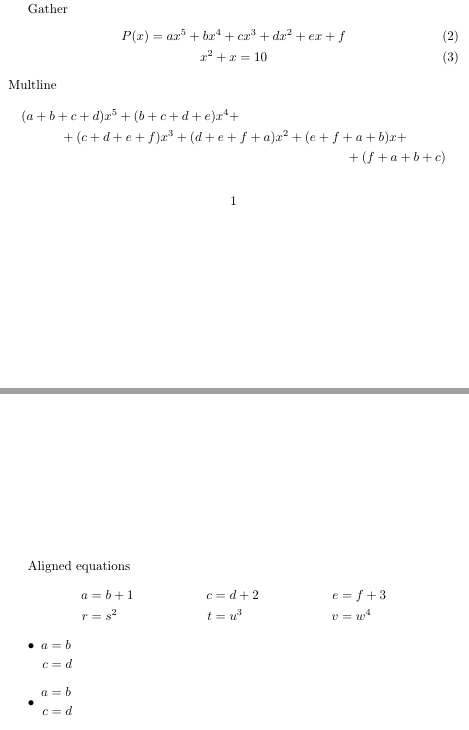

---
## Front matter
lang: ru-RU
title: Лабораторная работа №3
subtitle: Научное программирование
author:
  - Николаев Дмитрий Иванович, НПМмд-02-24
institute:
  - Российский университет дружбы народов имени Патриса Лумумбы, Москва, Россия
date: 7 сентября 2024

## i18n babel
babel-lang: russian
babel-otherlangs: english

## Formatting pdf
toc: false
toc-title: Содержание
slide_level: 2
aspectratio: 169
section-titles: true
theme: metropolis
header-includes:
 - \metroset{progressbar=frametitle,sectionpage=progressbar,numbering=fraction}
 - '\makeatletter'
 - '\beamer@ignorenonframefalse'
 - '\makeatother'
---

# Прагматика выполнения

- Освоение основ работы с языком программирования Octave

# Цели

Получение первичных практических навыков работы с языком Octave.

# Задачи

1. Освоить простейшие арифметические операции и операции с векторами и матрицами в Octave;
2. Освоить построение простейших графиков в Octave;
3. Сравненить быстродействие циклов и операций с векторами в Octave.

# Выполнение работы

## Простейшие операции

{#fig:001 width=80%}

## Операции с векторами

{#fig:002 width=80%}

## Вычисление проектора

{#fig:003 width=80%}

## Матричные операции 1

{#fig:004 width=80%}

## Матричные операции 2

{#fig:005 width=80%}

## Построение простейших графиков 1

{#fig:006 width=80%}

## Построение простейших графиков 2

{#fig:graph1 width=80%}

## Построение простейших графиков 3

{#fig:graph2 width=80%}

## Два графика на одном чертеже 1

{#fig:007 width=80%}

## Два графика на одном чертеже 2

{#fig:graph3 width=80%}

## График $y = x^2 \sin x$ 

{#fig:graph4 width=80%}

## Сравнение циклов и операций с векторами 1

{#fig:008 width=80%}

## Сравнение циклов и операций с векторами 2

{#fig:009 width=80%}

## Сравнение циклов и операций с векторами 3

{#fig:010 width=80%}

# Результаты

По результатам работы, я получил первичные практические навыки работы с Octave.
