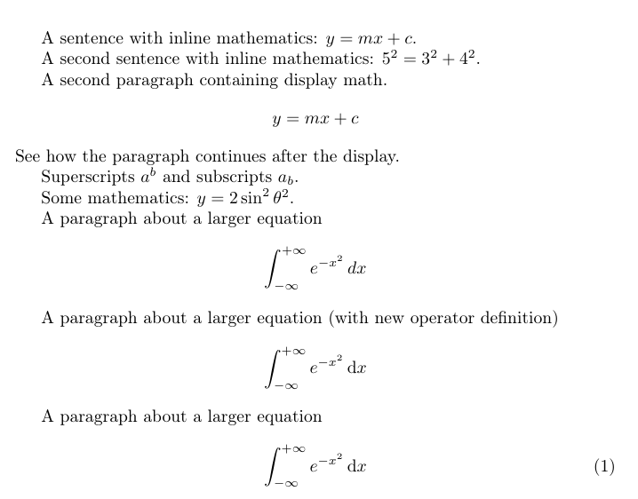
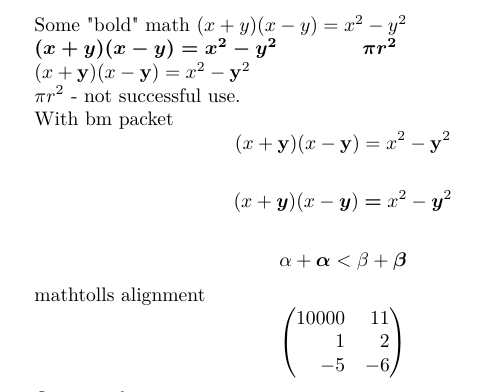

---
## Front matter
title: "Лабораторная работа №3"
subtitle: "Научное программирование"
author: "Николаев Дмитрий Иванович, НПМмд-02-24"

## Generic otions
lang: ru-RU
toc-title: "Содержание"

## Bibliography
bibliography: bib/cite.bib
csl: pandoc/csl/gost-r-7-0-5-2008-numeric.csl

## Pdf output format
toc: true # Table of contents
toc-depth: 2
lof: true # List of figures
lot: true # List of tables
fontsize: 12pt
linestretch: 1.5
papersize: a4
documentclass: scrreprt
## I18n polyglossia
polyglossia-lang:
  name: russian
  options:
	- spelling=modern
	- babelshorthands=true
polyglossia-otherlangs:
  name: english
## I18n babel
babel-lang: russian
babel-otherlangs: english
## Fonts
mainfont: PT Serif
romanfont: PT Serif
sansfont: PT Sans
monofont: PT Mono
mainfontoptions: Ligatures=TeX
romanfontoptions: Ligatures=TeX
sansfontoptions: Ligatures=TeX,Scale=MatchLowercase
monofontoptions: Scale=MatchLowercase,Scale=0.9
## Biblatex
biblatex: true
biblio-style: "gost-numeric"
biblatexoptions:
  - parentracker=true
  - backend=biber
  - hyperref=auto
  - language=auto
  - autolang=other*
  - citestyle=gost-numeric
## Pandoc-crossref LaTeX customization
figureTitle: "Рис."
tableTitle: "Таблица"
listingTitle: "Листинг"
lofTitle: "Список иллюстраций"
lotTitle: "Список таблиц"
lolTitle: "Листинги"
## Misc options
indent: true
header-includes:
  - \usepackage{indentfirst}
  - \usepackage{float} # keep figures where there are in the text
  - \floatplacement{figure}{H} # keep figures where there are in the text
---

# Цель работы

Получение первичных практических навыков работы с языком Octave.

# Теоретическое введение

## Введение

GNU Octave --- это высокоуровневый язык программирования, предназначенный для численных вычислений [@doc]. Он является мощной альтернативой MATLAB и предоставляет пользователям возможность решать задачи математического моделирования, анализа данных и научных исследований. С момента своего появления, Octave завоевал популярность среди студентов, исследователей и инженеров благодаря своей доступности и функциональности.

## История и развитие

Octave был создан в начале 1990-х годов Джоном Д. Бейнсом и стал одним из первых проектов в области свободного программного обеспечения для выполнения числовых операций. С тех пор он активно развивался, и его функционал постоянно расширялся. С момента последнего стабильного релиза, Octave продолжает поддерживаться и обновляться сообществом, что позволяет ему оставаться актуальным инструментом для научных исследований и инженерных задач.

## Основные особенности

Octave поддерживает большинство функций MATLAB, что позволяет пользователям с опытом работы в MATLAB без труда осваивать его. Среди основных особенностей Octave можно выделить:

- Векторизация: Это позволяет выполнять операции над массивами матриц и векторов, что значительно ускоряет вычисления по сравнению с обычными циклами.
- Интерактивная среда: Octave предоставляет пользовательский интерфейс командной строки, что упрощает тестирование и отладку кода.
- Богатая библиотека функций: В Octave имеется множество встроенных функций для работы с математикой, статистикой, линейной алгеброй и сигналами.
- Графические возможности: Инструменты для построения графиков и визуализации данных делают Octave мощным инструментом для анализа данных.

## Применение

Octave находит применение в самых различных областях, включая:

- Инженерия: Моделирование и симуляция систем управления.
- Научные исследования: Анализ и визуализация данных в физических и биологических науках.
- Образование: Преподавание численных методов и программирования.

# Выполнение лабораторной работы

Следуем указаниям [@lab3]

## Простейшие операции

1. Включите журналирование сессии.

    ```
    diary on
    ```

2. Поскольку оператор `diary` является переключателем, то достаточно ввести:

    ```
    diary
    ```

    чтобы переключить состояние журналирования.

3. Octave можно использовать как простейший калькулятор. Вычислим выражение:  

   $$ 2 \times 6 + (7 - 4)^2 $$

   В Octave это будет иметь следующий вид:

    ```
    2*6 + (7-4)^2
    ans = 21
    ```

4. Зададим вектор-строку (ковектор):
   $$
   \mathbf{u} = (1, -4, 6)
   $$

    ```
    u = [1 -4 6]
    u =
       1  -4  6
    ```

5. Аналогично можно задать вектор-столбец (вектор) ([@fig:001]):
   $$
   \mathbf{u} =
   \begin{pmatrix}
      1  \\
     -4  \\
      6
   \end{pmatrix}
   $$

    ```
    u = [1; -4; 6]
    u =
       1
      -4
       6
    ```

6. Теперь зададим матрицу:
   $$
   \mathbf{A} =
   \begin{pmatrix}
      1 & 2  & -3 \\
      2 & 4  &  0 \\
      1 & 1  &  1
   \end{pmatrix}
   $$

    ```
    A = [1 2 -3; 2 4 0; 1 1 1]
    A =
       1  2 -3
       2  4  0
       1  1  1
    ```

    {#fig:001 width=80%}

## Операции с векторами

1. Зададим два вектора-столбца:
    $$
   \mathbf{u} =
   \begin{pmatrix}
      1  \\
     -4  \\
      6
   \end{pmatrix}, \quad
   \mathbf{v} =
   \begin{pmatrix}
      2  \\
      1  \\
     -1
   \end{pmatrix}
   $$

    ```
    u = [1; -4; 6]
    v = [2; 1; -1]
    ```

2. Сложение векторов:
   $$
   2\mathbf{v} + 3\mathbf{u}
   $$

    ```
    2*v + 3*u
    ans =
       7
     -10
      16
    ```

3. Скалярное умножение векторов $\mathbf{u} \cdot \mathbf{v}$:

    ```
    dot(u, v)
    ans = -8
    ```

4. Векторное умножение $\mathbf{u} \times \mathbf{v}$:

    ```
    cross(u, v)
    ans =
      -2
      13
       9
    ```

5. Норма вектора $\|\mathbf{u}\|$ ([@fig:002]):

    ```
    norm(u)
    ans = 7.2801
    ```

    {#fig:002 width=80%}

## Вычисление проектора

1. Введём два вектора-строки:
   $$
   \mathbf{u} = (3, 5), \quad \mathbf{v} = (7, 2)
   $$

    ```
    u = [3 5]
    v = [7 2]
    ```

2. Вычислим проекцию вектора $\mathbf{u}$ на вектор $\mathbf{v}$. Пусть $\theta$~--- угол между $\mathbf{u}$ и $\mathbf{v}$. Тогда верна формула:

    $$
    \|\text{proj}_{\mathbf{v}} \mathbf{u}\| = \|\mathbf{u}\| \cos \theta.
    $$

    Учитывая, что

    $$
    \mathbf{u} \cdot \mathbf{v} = \|\mathbf{u}\| \|\mathbf{v}\| \cos \theta,
    $$

    запишем:

    $$
    \|\text{proj}_{\mathbf{v}} \mathbf{u}\| = \|\mathbf{u}\| \cos \theta = \frac{\mathbf{u} \cdot \mathbf{v}}{\|\mathbf{v}\|}.
    $$

    Поскольку направление проекции совпадает с направлением вектора $\mathbf{v}$, то запишем:

    $$
    \text{proj}_{\mathbf{v}} \mathbf{u} = \frac{\mathbf{u} \cdot \mathbf{v}}{\|\mathbf{v}\|} \cdot \frac{\mathbf{v}}{\|\mathbf{v}\|} = \frac{\mathbf{u} \cdot \mathbf{v}}{\|\mathbf{v}\|^2} \mathbf{v}.
    $$

    В Octave это можно вычислить следующим образом ([@fig:003]):

    ```
    proj = dot(u, v) / (norm(v))^2 * v
    proj =
       4.0943   1.1698
    ```

    {#fig:003 width=80%}

## Матричные операции

1. Введём матрицы $\mathbf{A}$ и $\mathbf{B}$:

    $$
    \mathbf{A} = \begin{pmatrix}
    1 & 2 & -3 \\
    2 & 4 & 0 \\
    1 & 1 & 1
    \end{pmatrix}
    , \quad
    \mathbf{B} = \begin{pmatrix}
    1 & 2 & 3 & 4 \\
    0 & -2 & -4 & 6 \\
    1 & -1 & 0 & 0
    \end{pmatrix}.
    $$


    ```
    A = [1 2 -3; 2 4 0; 1 1 1]
    B = [1 2 3 4; 0 -2 -4 6; 1 -1 0 0]
    ```

2. Вычислим произведение матриц $\mathbf{A} \cdot \mathbf{B}$:

    ```
    A * B
    ans =
      -2   1  -5  16
       2  -4 -10  32
       2  -1  -1  10
    ```

3. Вычислим произведение матриц $\mathbf{B}^T \cdot \mathbf{A}$:

    ```
    B' * A
    ans =
       2   3  -2
      -3  -5  -7
      -5 -10  -9
      16  32 -12
    ```

4. Вычислим $2\mathbf{A} - 4\mathbf{I}$ ([@fig:004]):

    ```
    2 * A - 4 * eye(3)
    ans =
      -2   4  -6
       4   4   0
       2   2  -2
    ```

5. Найдём определитель $|\mathbf{A}|$:

    ```
    det(A)
    ans = 6
    ```

6. Найдём обратную матрицу $\mathbf{A}^{-1}$:

    ```
    inv(A)
    ans =
       0.66667  -0.83333   2.00000
      -0.33333   0.66667  -1.00000
      -0.33333   0.16667   0.00000
    ```

7. Найдём собственные значения матрицы $\mathbf{A}$:

    ```
    eig(A)
    ans =
       4.52510 + 0.00000i
       0.73745 + 0.88437i
       0.73745 - 0.88437i
    ```

8. Найдём ранг матрицы $\mathbf{A}$ ([@fig:005]):

    ```
    rank(A)
    ans = 3
    ```

    {#fig:004 width=80%}
    
    {#fig:005 width=80%}

## Построение простейших графиков

Построим график функции $\sin x$ на интервале $[0, 2\pi]$

1. Создадим вектор значений $x$:

   ```octave
   x = linspace(0, 2*pi, 50);
   ```

   Команда `linspace(начальное_значение, конечное_значение, n)` создаёт вектор-строку из $n$ равномерно распределённых значений на заданном интервале. Чем меньше приращение, тем более гладкой будет выглядеть кривая. Точка с запятой в конце строки подавляет вывод на экран.

2. Зададим вектор $y = \sin x$:

   ```octave
   y = sin(x);
   ```

3. Построим график:

   ```octave
   plot(x, y);
   ```

   В результате получим следующий график (рис. [@fig:graph1]).

   {#fig:graph1 width=80%}

4. Улучшим внешний вид графика. Сначала очистим получившийся график:

   ```octave
   clf;
   ```

   Заданные вектора $x$ и $y$ сохранятся.

5. Зададим красный цвет для линии и сделаем её потолще:

   ```octave
   plot(x, y, 'r', 'linewidth', 3);
   ```

6. Подгоним диапазон осей:

   ```octave
   axis([0 2*pi -1 1]);
   ```

7. Нарисуем сетку:

   ```octave
   grid on;
   ```

8. Подпишем оси:

   ```octave
   xlabel('x');
   ylabel('y');
   ```

9. Сделаем заголовок графика:

   ```octave
   title('Sine graph');
   ```

10. Зададим легенду ([@fig:006]):

    ```octave
    legend('y=sin(x)');
    ```

    {#fig:006 width=80%}

    В результате получим следующий график (рис. [@fig:graph1]).

    {#fig:graph2 width=80%}

## Два графика на одном чертеже

1. Очистим память и рабочую область фигуры:

   ```octave
   clear;
   clf;
   ```

2. Зададим два вектора:

   ```octave
   x = [1 2 3 4];
   y = [1 2 5 4];
   ```

3. Построим эти точки, используя кружочки как маркеры:

   ```octave
   plot(x, y, 'o');
   ```

4. Чтобы добавить к нашему графику ещё один, используем команду:

   ```octave
   hold on;
   ```

5. Добавим график регрессии:

   ```octave
   plot(x, 1.2*x);
   ```

6. Зададим сетку, оси и легенду ([@fig:007]):

   ```octave
   grid on;
   axis([0 5 0 6]);
   legend('data points', 'regressionline');
   ```

   {#fig:007 width=80%}

   В результате получим график (рис. [@fig:graph3]).

   {#fig:graph3 width=80%}

## График $y = x^2 \sin x$

Построим график $y = x^2 \sin x$.

1. Очистим память и рабочую область фигуры:

    ```octave
    clear;
    clf;
    ```

2. Зададим вектор $x$:

    ```octave
    x = linspace(-10, 10, 100);
    ```

3. Построим график $y = x^2 \sin x$:

    ```octave
    plot(x, x^2 * sin(x))
    ```

    Ошибка:

    ```octave
    error: for x^y, only square matrix arguments are permitted and one argument must be scalar. Use .^ for elementwise power.
    ```

    Ничего не получилось. Мы задали в выражении матричное умножение, в то время как нужно поэлементное.

4. Построим график $y = x^2 \sin x$, используя поэлементное возведение в степень `.^` и поэлементное умножение `.*`:
    
    ```octave
    plot(x, x.^2 .* sin(x))
    ```

5. Сохраним графики в виде файлов (два разных формата вызова функции):
    
    ```octave
    print graph2.png -dpng
    print('graph2.pdf', '-dpdf')
    ```

    В результате получим график (рис. [@fig:graph4]).

   {#fig:graph4 width=80%}

## Сравнение циклов и операций с векторами

Сравним эффективность работы с циклами и операций с векторами. Для этого вычислим сумму:

$$
\sum_{n=1}^{1000000} \frac{1}{n^2}
$$

1. Очистим память и рабочую область фигуры:

   ```octave
   clear;
   clf;
   ```

2. Вычислим сумму $\sum_{n=1}^{100000} \frac{1}{n^2}$ с помощью цикла. Создадим файл `loop_for.m` ([@fig:008]):

   ```octave
   clear;
   tic;
   s = 0;
   for n = 1:100000
       s = s + 1/n^2;
   end
   toc;
   ```

   Функции `tic` и `toc` служат для запуска и остановки таймера.

   {#fig:008 width=80%}

3. Запустим файл `loop_for.m`. Вывод:

   ```
   Elapsed time is 0.117988 seconds.
   ```

4. Вычислим ту же сумму с помощью операций с векторами. Создадим файл `loop_vec.m` ([@fig:009]):

   ```octave
   clear;
   tic;
   n = 1:100000;
   s = sum(1./n.^2);
   toc;
   ```

   {#fig:009 width=80%}

5. Запустим файл `loop_vec.m`. Вывод:

   ```
   Elapsed time is 0.00294495 seconds.
   ```

Сравните результаты ([@fig:010]).

   {#fig:010 width=80%}

6. Завершим запись в файл:

    ```
    diary off
    ```

# Выводы

В ходе выполнения лабораторной работы я получил первичные практические навыки работы с высокоуровневым языком программирования Octave.

# Список литературы{.unnumbered}

::: {#refs}
:::
