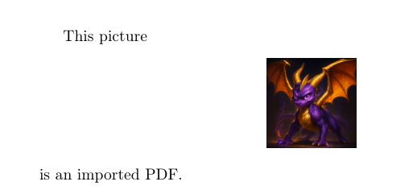
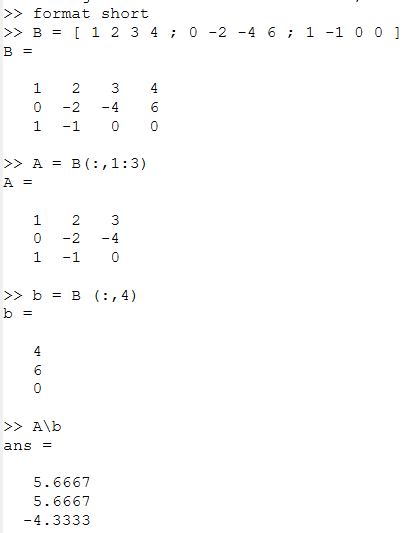
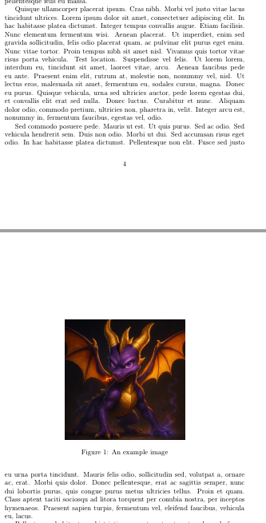
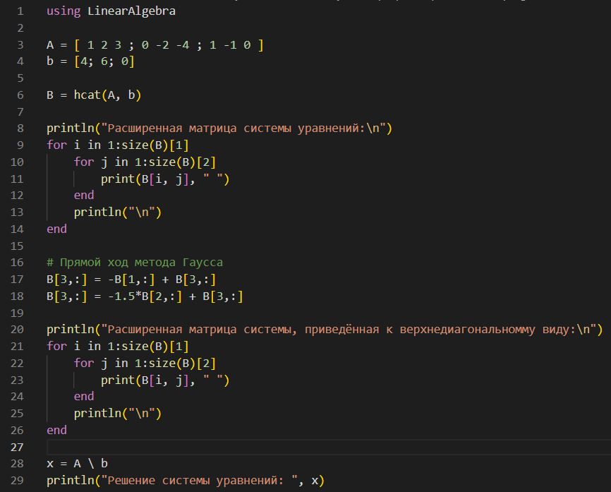
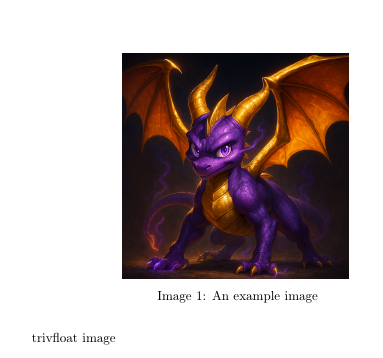
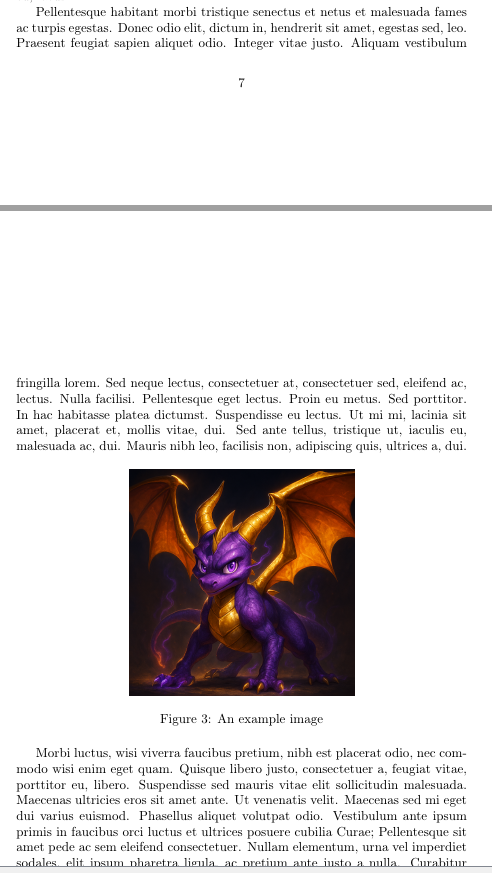
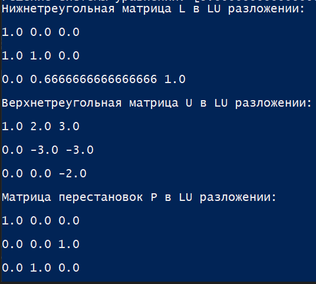

---
## Front matter
lang: ru-RU
title: Лабораторная работа №4
subtitle: Научное программирование
author:
  - Николаев Дмитрий Иванович, НПМмд-02-24
institute:
  - Российский университет дружбы народов имени Патриса Лумумбы, Москва, Россия
date: 29 сентября 2024

## i18n babel
babel-lang: russian
babel-otherlangs: english

## Formatting pdf
toc: false
toc-title: Содержание
slide_level: 2
aspectratio: 169
section-titles: true
theme: metropolis
header-includes:
 - \metroset{progressbar=frametitle,sectionpage=progressbar,numbering=fraction}
 - '\makeatletter'
 - '\beamer@ignorenonframefalse'
 - '\makeatother'
---

# Прагматика выполнения

- Повышение навыков работы с Octave и Julia;
- Знакомство с методом Гаусса решения СЛАУ;
- Знакомство с LU- и LUP-разложениями обратимых матриц.

# Цели

Изучение методов решения систем линейных уравнений, включая метод Гаусса, LU-разложение и LUP-разложение, а также их программная реализация.

# Задачи

1. Для системы линейных уравнений:

$$
A x = b \rightarrow \begin{pmatrix} 1 & 2 & 3 \\ 0 & -2 & -4 \\ 1 & -1 & 0 \end{pmatrix} \begin{pmatrix} x_1 \\ x_2 \\ x_3 \end{pmatrix} = \begin{pmatrix} 4 \\ 6 \\ 0 \end{pmatrix},
$$
построить расширенную матрицу вида:
$$
B = [A|b] = \begin{pmatrix} 1 & 2 & 3 & 4 \\ 0 & -2 & -4 & 6 \\ 1 & -1 & 0 & 0 \end{pmatrix}.
$$

2. Реализовать решение методом Гаусса, LU- и LUP-разложения для матрицы $A$ в Octave и Julia.

# Выполнение работы

## Метод Гаусса в Octave

{#fig:001 width=70%}

## Левое деление в Octave

{#fig:002 width=70%}

## LU- и LUP-разложение в Octave

{#fig:003 width=70%}

## Метод Гаусса и встроенное решение системы уравнений в Julia (1\2)

{#fig:004 width=70%}

## Метод Гаусса и встроенное решение системы уравнений в Julia (2\2)

{#fig:006 width=70%}

## LU- и LUP-разложение в Julia (1\2)

{#fig:005 width=70%}

## LU- и LUP-разложение в Julia (2\2)

{#fig:007 width=70%}

# Результаты

По результатам работы, я изучил метод Гаусса, LU- и LUP-разложения, а также реализовал обозначенные алгоритмы на Octave и Julia.
