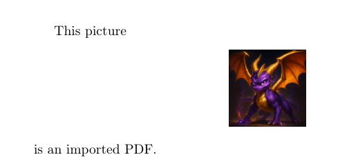
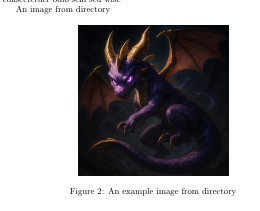
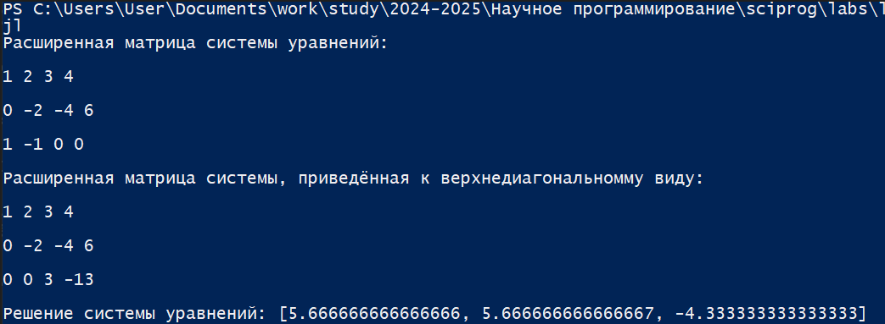
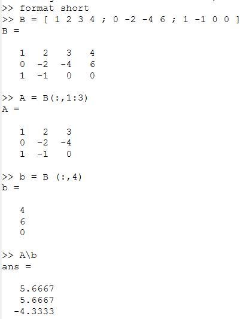
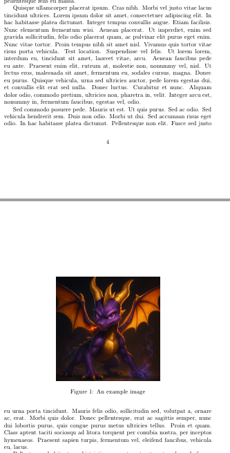
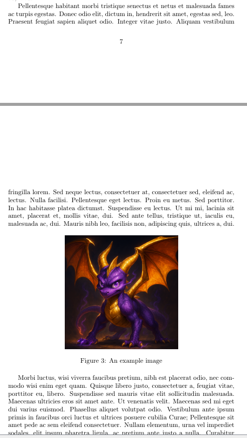
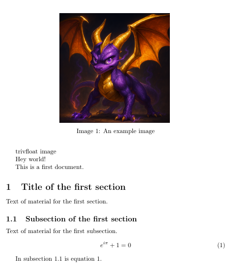

---
## Front matter
title: "Лабораторная работа №4"
subtitle: "Научное программирование"
author: "Николаев Дмитрий Иванович, НПМмд-02-24"

## Generic otions
lang: ru-RU
toc-title: "Содержание"

## Bibliography
bibliography: bib/cite.bib
csl: pandoc/csl/gost-r-7-0-5-2008-numeric.csl

## Pdf output format
toc: true # Table of contents
toc-depth: 2
lof: true # List of figures
lot: true # List of tables
fontsize: 12pt
linestretch: 1.5
papersize: a4
documentclass: scrreprt
## I18n polyglossia
polyglossia-lang:
  name: russian
  options:
	- spelling=modern
	- babelshorthands=true
polyglossia-otherlangs:
  name: english
## I18n babel
babel-lang: russian
babel-otherlangs: english
## Fonts
mainfont: PT Serif
romanfont: PT Serif
sansfont: PT Sans
monofont: PT Mono
mainfontoptions: Ligatures=TeX
romanfontoptions: Ligatures=TeX
sansfontoptions: Ligatures=TeX,Scale=MatchLowercase
monofontoptions: Scale=MatchLowercase,Scale=0.9
## Biblatex
biblatex: true
biblio-style: "gost-numeric"
biblatexoptions:
  - parentracker=true
  - backend=biber
  - hyperref=auto
  - language=auto
  - autolang=other*
  - citestyle=gost-numeric
## Pandoc-crossref LaTeX customization
figureTitle: "Рис."
tableTitle: "Таблица"
listingTitle: "Листинг"
lofTitle: "Список иллюстраций"
lotTitle: "Список таблиц"
lolTitle: "Листинги"
## Misc options
indent: true
header-includes:
  - \usepackage{indentfirst}
  - \usepackage{float} # keep figures where there are in the text
  - \floatplacement{figure}{H} # keep figures where there are in the text
---

# Цель работы

Изучение методов решения систем линейных уравнений, включая метод Гаусса, LU-разложение и LUP-разложение, а также их программная реализация.

# Теоретическое введение

## Метод Гаусса

Запишем исходную систему:

$$
\begin{cases}
a_{11}x_1 + \dots + a_{1n}x_n = b_1 \\
\vdots \\
a_{m1}x_1 + \dots + a_{mn}x_n = b_m
\end{cases}
$$

в матричном виде:

$$A x = b,$$

где

$$
A = \begin{pmatrix}
a_{11} & \dots & a_{1n} \\
\vdots & \ddots & \vdots \\
a_{m1} & \dots & a_{mn}
\end{pmatrix}, \quad x = \begin{pmatrix} x_1 \\ \vdots \\ x_n \end{pmatrix}, \quad b = \begin{pmatrix} b_1 \\ \vdots \\ b_m \end{pmatrix}.
$$

Матрица $A$ называется основной матрицей системы, $b$ --- столбцом свободных членов.

Алгоритм решения СЛАУ методом Гаусса подразделяется на два этапа:

1. \textbf{Прямой ход}: осуществляется последовательное приведение системы к треугольному виду с помощью элементарных преобразований строк. В ходе прямого хода вычитаются строки системы, домноженные на определённые коэффициенты, чтобы получить в столбце под диагональным элементом нули.
2. \textbf{Обратный ход}: после приведения системы к треугольному виду, начиная с последнего уравнения, происходит нахождение значений переменных. Это называется обратной подстановкой, при которой вычисленное значение переменной используется для упрощения последующих уравнений.

Для приведения матрицы к треугольному виду используют расширенную матрицу вида:

$$
B = [A|b] = \begin{pmatrix} a_{11} & \dots & a_{1n} & b_1 \\ \vdots & \ddots & \vdots & \vdots \\ a_{m1} & \dots & a_{mn} & b_m \end{pmatrix}.
$$

Метод Гаусса позволяет решать совместные системы линейных уравнений или определять их несовместность.

## LU-разложение

LU-разложение --- это способ разложения матрицы $A$ на произведение двух матриц $L$ (нижняя треугольная матрица) и $U$ (верхняя треугольная матрица) $A = LU$. Это разложение особенно удобно для решения систем линейных уравнений и нахождения обратной матрицы. Это используется для решения системы $A x = b$ через два шага:

1. Сначала решаем систему $L y = b$ методом прямой подстановки..
2. Затем решаем систему $U x = y$ методом обратной подстановки.

LU-разложение возможно только для невырожденных матриц, для которых существуют обратные матрицы.

### Решение систем линейных уравнений

Если известно LU-разложение матрицы $A$, система $A x = b$ может быть решена в два шага:

1. $L y = b$
2. $U x = y$

### Обращение матриц

Обращение матрицы $A$ эквивалентно решению системы $A X = I$, где $X$ --- обратная матрица, а $I$ --- единичная матрица.

### Вычисление определителя матрицы

Определитель матрицы $A$ через LU-разложение:

$$
\det(A) = \det(LU) = \det(L) \det(U) = \prod_{i=1}^{n} L_{ii} \prod_{j=1}^{n} U_{jj},
$$
где $n$ --- размер матрицы $A$, $L_{ii}$ и $U_{jj}$ --- диагональные элементы матриц $L$ и $U$ соответственно.

## LUP-разложение

LUP-разложение представляет собой расширение LU-разложения, которое позволяет работать с системами, требующими перестановки строк для получения нужной формы матрицы. В этом случае матрица $A$ представляется в виде:

$$
P A = LU,
$$
где $P$ --- матрица перестановок. Этот метод является улучшенным вариантом LU-разложения и применяется, когда требуется учитывать перестановку строк для обеспечения вычислительной устойчивости.

# Выполнение лабораторной работы

Следуем указаниям [-@lab4]

## Метод Гаусса

Для системы $A x = b$:
$$
A = \begin{pmatrix} 1 & 2 & 3 \\ 0 & -2 & -4 \\ 1 & -1 & 0 \end{pmatrix}, \quad b = \begin{pmatrix} 4 \\ 6 \\ 0 \end{pmatrix},
$$

построим расширенную матрицу:
$$
B = \begin{pmatrix} 1 & 2 & 3 & 4 \\ 0 & -2 & -4 & 6 \\ 1 & -1 & 0 & 0 \end{pmatrix}.
$$

Далее приведём матрицу к треугольному виду и решим систему в Octave ([@fig:001]) и Julia ([@fig:004,@fig:006]).

{#fig:001 width=70%}

{#fig:004 width=70%}

{#fig:006 width=70%}

## Левое деление

В Octave встроенная операция для решения систем $A x = b$ называется левым делением и записывается как $A \backslash b$ ([@fig:002]).

{#fig:002 width=70%}

## LU- и LUP-разложение

Для матрицы $A$:
$$
A = \begin{pmatrix} 1 & 2 & 3 \\ 0 & -2 & -4 \\ 1 & -1 & 0 \end{pmatrix},
$$
выполним LU- и LUP-разложение в Octave ([@fig:003]) и Julia ([@fig:005,@fig:007]).

{#fig:003 width=70%}

{#fig:005 width=70%}

{#fig:007 width=70%}

# Выводы

В ходе выполнения лабораторной работы я изучил метод Гаусса, LU- и LUP-разложения, а также реализовал обозначенные алгоритмы на Octave и Julia.

# Список литературы{.unnumbered}

::: {#refs}
:::
