---
## Front matter
lang: ru-RU
title: Лабораторная работа №5
subtitle: Научное программирование
author:
  - Николаев Дмитрий Иванович, НПМмд-02-24
institute:
  - Российский университет дружбы народов имени Патриса Лумумбы, Москва, Россия
date: 29 сентября 2024

## i18n babel
babel-lang: russian
babel-otherlangs: english

## Formatting pdf
toc: false
toc-title: Содержание
slide_level: 2
aspectratio: 169
section-titles: true
theme: metropolis
header-includes:
 - \metroset{progressbar=frametitle,sectionpage=progressbar,numbering=fraction}
 - '\makeatletter'
 - '\beamer@ignorenonframefalse'
 - '\makeatother'
---

# Прагматика выполнения

- Получение навыков подгонки полиномиальной кривой в Octave и Julia;
- Получение навыков матричных преобразований: вращение, отражение, дилатация в Octave и Julia.

# Цели

Освоение подгонки полиномиальной кривой, матричных преобразований, вращения, отражения и дилатации, и их программные реализации.

# Задачи

1. Реализовать подгонку полиномиальной кривой в Octave и Julia;
2. Реализовать матричные преобразования --- вращение, отражение, дилатация в Octave и Julia.

# Выполнение работы

## Подгонка полиномиальной кривой. Octave (1/8)

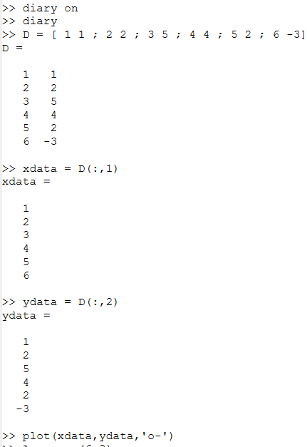{#fig:001 width=70%}

## Подгонка полиномиальной кривой. Octave (2/8)

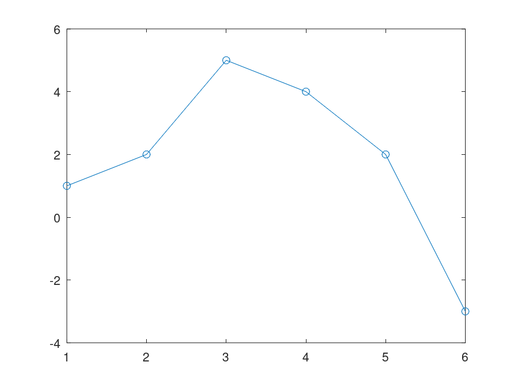{#fig:graph1 width=70%}

## Подгонка полиномиальной кривой. Octave (3/8)

{#fig:002 width=70%}

## Подгонка полиномиальной кривой. Octave (4/8)

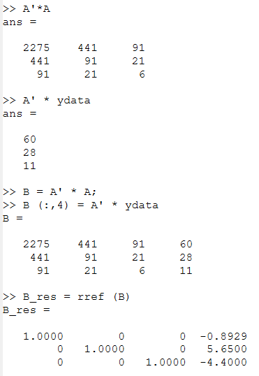{#fig:003 width=70%}

## Подгонка полиномиальной кривой. Octave (5/8)

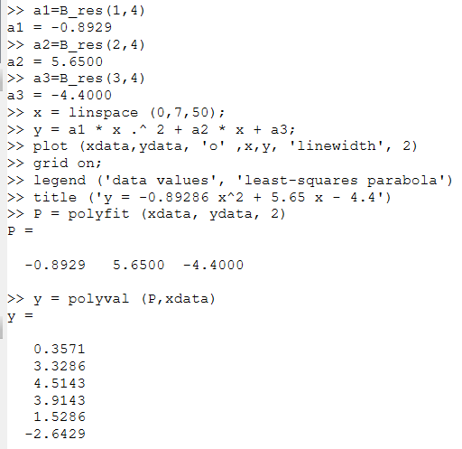{#fig:004 width=70%}

## Подгонка полиномиальной кривой. Octave (6/8)

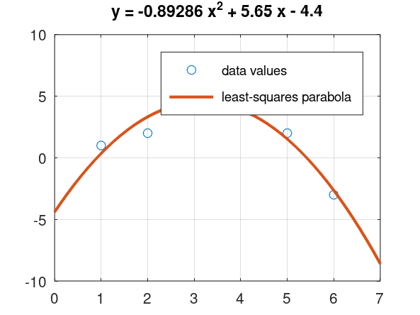{#fig:graph2 width=70%}

## Подгонка полиномиальной кривой. Octave (7/8)

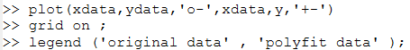{#fig:005 width=70%}

## Подгонка полиномиальной кривой. Octave (8/8)

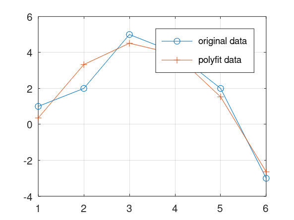{#fig:graph3 width=70%}

## Подгонка полиномиальной кривой. Julia (1/3)

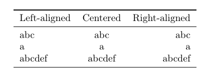{#fig:011 width=70%}

## Подгонка полиномиальной кривой. Julia (2/3)

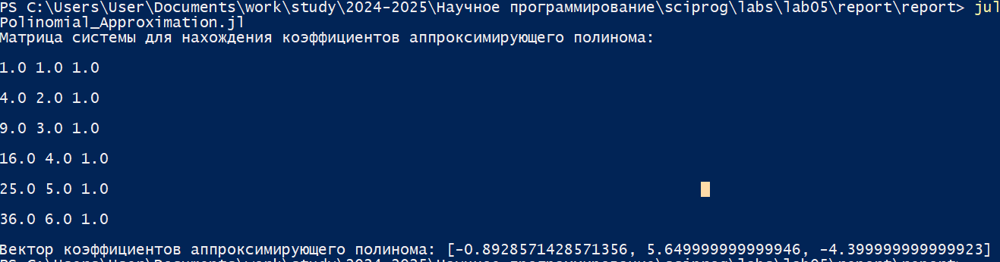{#fig:012 width=70%}

## Подгонка полиномиальной кривой. Julia (3/3)

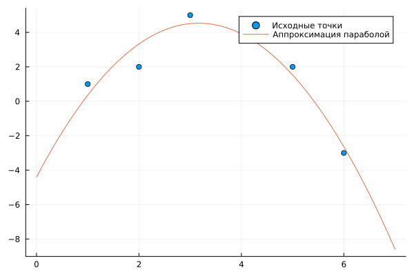{#fig:graph8 width=70%}

## Матричные преобразования. Octave (1/9)

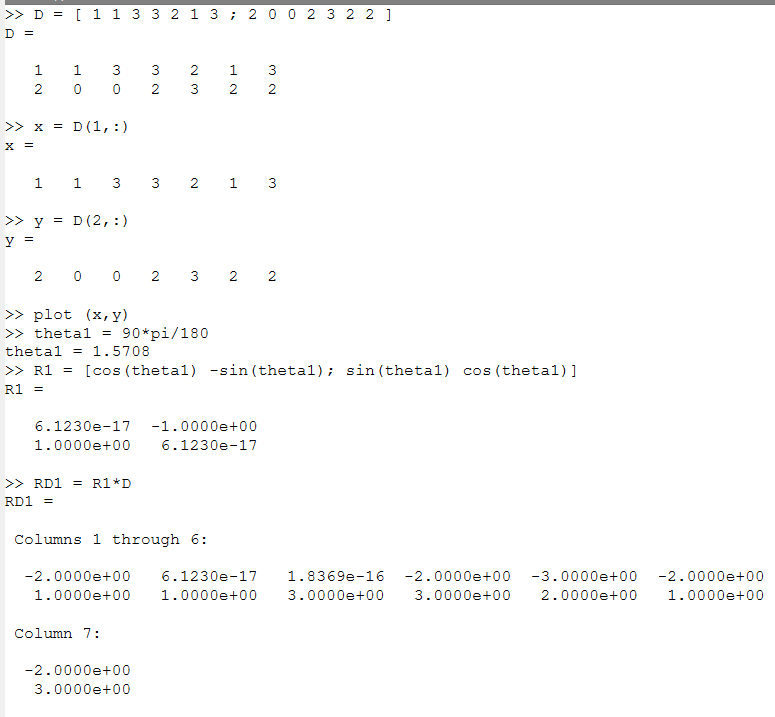{#fig:006 width=70%}

## Матричные преобразования. Octave (2/9)

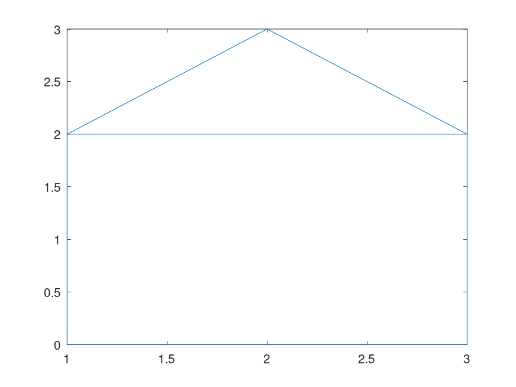{#fig:graph4 width=70%}

## Матричные преобразования. Octave (3/9)

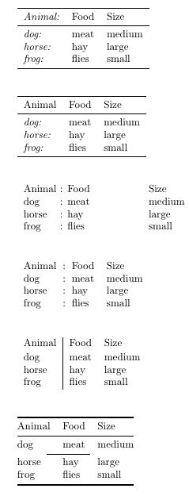{#fig:007 width=70%}

## Матричные преобразования. Octave (4/9)

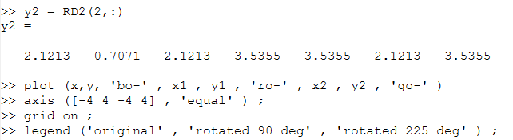{#fig:008 width=70%}

## Матричные преобразования. Octave (5/9)

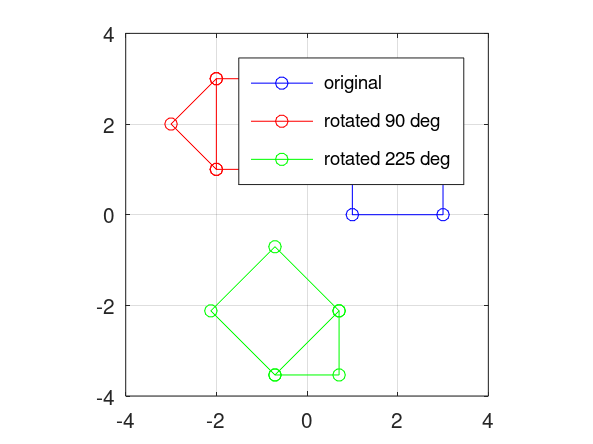{#fig:graph5 width=70%}

## Матричные преобразования. Octave (6/9)

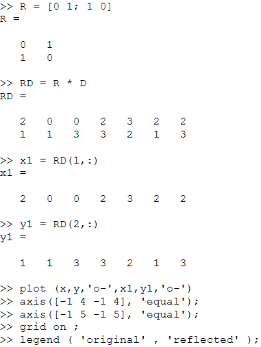{#fig:009 width=70%}

## Матричные преобразования. Octave (7/9)

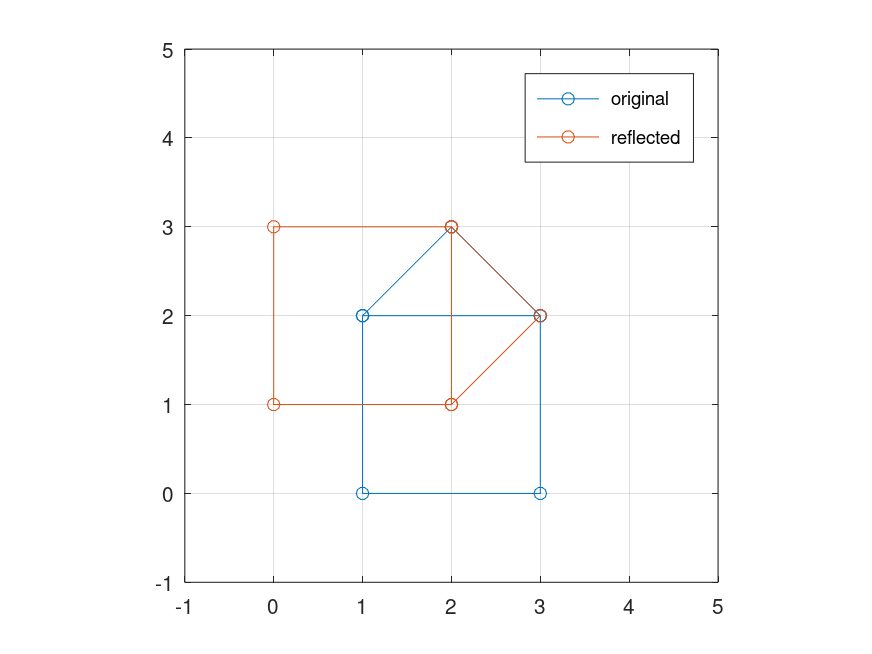{#fig:graph6 width=70%}

## Матричные преобразования. Octave (8/9)

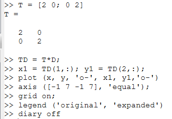{#fig:010 width=70%}

## Матричные преобразования. Octave (9/9)

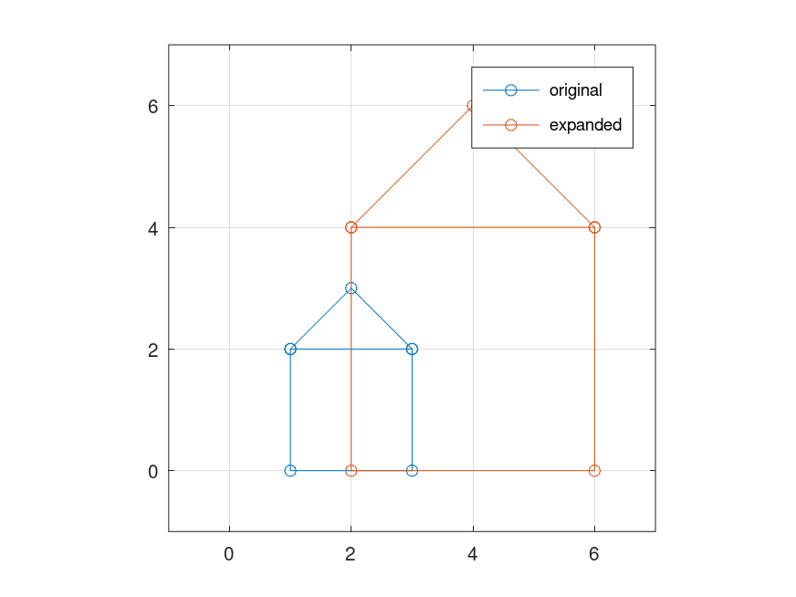{#fig:graph7 width=70%}

## Матричные преобразования. Julia (1/5)

{#fig:013 width=70%}

## Матричные преобразования. Julia (2/5)

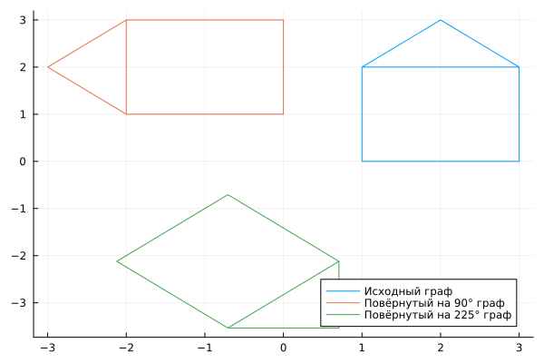{#fig:graph9 width=70%}

## Матричные преобразования. Julia (3/5)

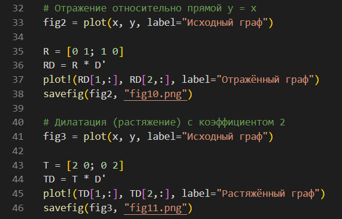{#fig:014 width=70%}

## Матричные преобразования. Julia (4/5)

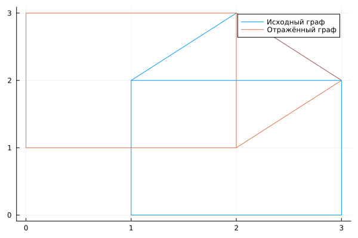{#fig:graph10 width=70%}

## Матричные преобразования. Julia (5/5)

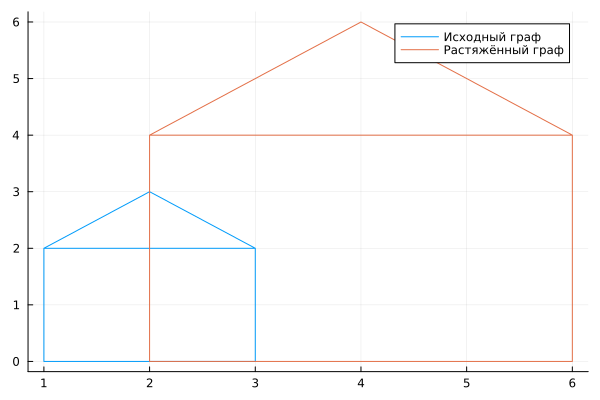{#fig:graph11 width=70%}

# Результаты

По результатам работы, я освоил методы подгонки полиномиальной кривой, матричных преобразований, вращения, отражения и дилатации, и их реализации в Octave и Julia.
