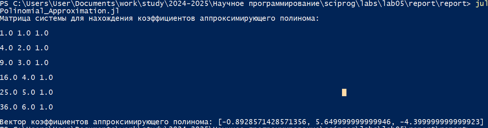
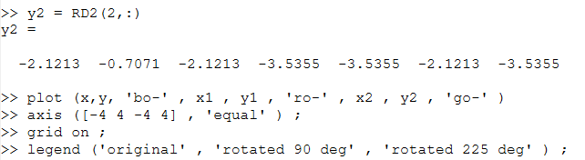
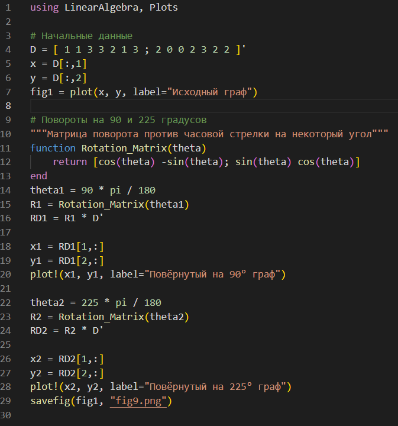

---
## Front matter
title: "Лабораторная работа №5"
subtitle: "Научное программирование"
author: "Николаев Дмитрий Иванович, НПМмд-02-24"

## Generic otions
lang: ru-RU
toc-title: "Содержание"

## Bibliography
bibliography: bib/cite.bib
csl: pandoc/csl/gost-r-7-0-5-2008-numeric.csl

## Pdf output format
toc: true # Table of contents
toc-depth: 2
lof: true # List of figures
lot: true # List of tables
fontsize: 12pt
linestretch: 1.5
papersize: a4
documentclass: scrreprt
## I18n polyglossia
polyglossia-lang:
  name: russian
  options:
	- spelling=modern
	- babelshorthands=true
polyglossia-otherlangs:
  name: english
## I18n babel
babel-lang: russian
babel-otherlangs: english
## Fonts
mainfont: PT Serif
romanfont: PT Serif
sansfont: PT Sans
monofont: PT Mono
mainfontoptions: Ligatures=TeX
romanfontoptions: Ligatures=TeX
sansfontoptions: Ligatures=TeX,Scale=MatchLowercase
monofontoptions: Scale=MatchLowercase,Scale=0.9
## Biblatex
biblatex: true
biblio-style: "gost-numeric"
biblatexoptions:
  - parentracker=true
  - backend=biber
  - hyperref=auto
  - language=auto
  - autolang=other*
  - citestyle=gost-numeric
## Pandoc-crossref LaTeX customization
figureTitle: "Рис."
tableTitle: "Таблица"
listingTitle: "Листинг"
lofTitle: "Список иллюстраций"
lotTitle: "Список таблиц"
lolTitle: "Листинги"
## Misc options
indent: true
header-includes:
  - \usepackage{indentfirst}
  - \usepackage{float} # keep figures where there are in the text
  - \floatplacement{figure}{H} # keep figures where there are in the text
---

# Цель работы

Освоение подгонки полиномиальной кривой, матричных преобразований, вращения, отражения и дилатации, и их реализации в Octave и Julia.

# Теоретическое введение

**Подгонка полиномиальной кривой** --- это один из методов аппроксимации данных, когда необходимо подобрать полином, который наилучшим образом соответствует заданным точкам. Наиболее распространённый способ для подгонки кривой --- метод наименьших квадратов, который минимизирует сумму квадратов отклонений между фактическими и прогнозируемыми значениями.

Для решения такой задачи используется система линейных уравнений, где коэффициенты полинома определяются решением матричных уравнений.

**Матричные преобразования** включают операции вращения, отражения и дилатации. Эти преобразования широко применяются в компьютерной графике и позволяют изменять координаты объектов:

- **Вращение** --- поворот объекта вокруг точки (обычно вокруг начала координат) на заданный угол.
- **Отражение** --- зеркальное отображение объекта относительно выбранной оси или линии.
- **Дилатация** --- увеличение или уменьшение объекта путём масштабирования.

# Выполнение лабораторной работы

Следуем указаниям [-@lab5]

## Подгонка полиномиальной кривой

Метод подгонки полиномиальной кривой заключается в нахождении полинома $y = ax^2 + bx + c$, который наилучшим образом описывает набор точек. Для этого необходимо решить систему линейных уравнений, в которой коэффициенты $a$, $b$ и $c$ получаются через матричные операции.

### Реализация в Octave

1. Вводим данные и строим график ([@fig:001,@fig:graph1]):

  ```octave
  D = [1 1; 2 2; 3 5; 4 4; 5 2; 6 -3];
  xdata = D(:,1);
  ydata = D(:,2);
  plot(xdata, ydata, 'o-');
  ```

  {#fig:001 width=70%}

  {#fig:graph1 width=70%}

2. Формируем систему уравнений и решаем методом наименьших квадратов ([@fig:002-@fig:004]):

  ```octave
  A = ones(6, 3);
  A(:, 1) = xdata.^2;
  A(:, 2) = xdata;
  B = A' * A;
  B(:, 4) = A' * ydata;
  B_res = rref(B);
  a1 = B_res(1,4);
  a2 = B_res(2,4);
  a3 = B_res(3,4);
  ```

  {#fig:002 width=70%}

  {#fig:003 width=70%}

  {#fig:004 width=70%}

3. Строим график параболы ([@fig:004,@fig:graph2]):

  ```octave
  x = linspace(0, 7, 50);
  y = a1 * x.^2 + a2 * x + a3;
  plot(xdata, ydata, 'o', x, y, 'linewidth', 2);
  grid on;
  legend('data values', 'least-squares parabola');
  title('y = -0.89286 x^2 + 5.65 x - 4.4');
  ```

  {#fig:graph2 width=70%}

4. Автоматизация с использованием встроенной функции ([@fig:004,@fig:005,@fig:graph3]):

  ```octave
  P = polyfit(xdata, ydata, 2);
  y = polyval(P, xdata);
  plot(xdata, ydata, 'o-', xdata, y, 'r+-');
  grid on;
  legend('original data', 'polyfit data');
  ```

  {#fig:005 width=70%}

  {#fig:graph3 width=70%}

### Реализация в Julia

Построение данных и их подгонка полиномиальной (второго порядка --- параболой) кривой ([@fig:011,@fig:012,@fig:graph8]):

{#fig:011 width=70%}

{#fig:012 width=70%}

{#fig:graph8 width=70%}

## Матричные преобразования

Матричные преобразования позволяют изменять координаты объектов. Каждое преобразование можно описать с помощью матрицы:  

- **Вращение** осуществляется с помощью матрицы поворота:  

  $$  
  R = \begin{pmatrix}  
  \cos \theta & -\sin \theta \\
  \sin \theta & \cos \theta  
  \end{pmatrix},
  $$  
  где $\theta$ --- угол поворота.  
- **Отражение** относительно оси $x = y$ задаётся матрицей:  

  $$  
  R = \begin{pmatrix}  
  0 & 1 \\
  1 & 0  
  \end{pmatrix}  
  $$  
- **Дилатация** (масштабирование) осуществляется с помощью матрицы:  

  $$  
  T = \begin{pmatrix}  
  k & 0 \\
  0 & k  
  \end{pmatrix}  
  $$  
  где $k$ --- коэффициент масштабирования.  

### Реализация в Octave

1. Построение графика первоначальной фигуры ([@fig:006,@fig:graph4]), её вращение на 90° и 225° ([@fig:006-@fig:008,@fig:graph5]):

  ```octave
  theta1 = 90 * pi / 180;
  R1 = [cos(theta1), -sin(theta1); sin(theta1), cos(theta1)];
  RD1 = R1 * D';
  plot(RD1(1,:), RD1(2,:), 'ro-');
  theta2 = 225 * pi / 180;
  R2 = [cos(theta2), -sin(theta2); sin(theta2), cos(theta2)];
  RD2 = R2 * D';
  plot(x, y, 'bo-', RD1(1,:), RD1(2,:), 'ro-', RD2(1,:), RD2(2,:), 'go-');
  grid on;
  ```

  {#fig:006 width=70%}

  {#fig:graph4 width=70%}

  {#fig:007 width=70%}

  {#fig:008 width=70%}

  {#fig:graph5 width=70%}

2. Отражение относительно прямой $x = y$ ([@fig:009,@fig:graph6]):

  ```octave
  R = [0 1; 1 0];
  RD = R * D';
  plot(x, y, 'o-', RD(1,:), RD(2,:), 'o-');
  grid on;
  ```

  {#fig:009 width=70%}

  {#fig:graph6 width=70%}
  
3. Дилатация (увеличение) в 2 раза ([@fig:010,@fig:graph7]):

  ```octave
  T = [2 0; 0 2];
  TD = T * D';
  plot(x, y, 'o-', TD(1,:), TD(2,:), 'o-');
  grid on;
  ```

  {#fig:010 width=70%}

  {#fig:graph7 width=70%}

### Реализация в Julia

Реализация вращения ([@fig:013,@fig:graph9]), отражения и дилатации в два раза ([@fig:014,@fig:graph10,@fig:graph11]):

{#fig:013 width=70%}

{#fig:graph9 width=70%}

{#fig:014 width=70%}

{#fig:graph10 width=70%}

{#fig:graph11 width=70%}

# Выводы

В ходе выполнения лабораторной работы я освоил методы подгонки полиномиальной кривой, матричных преобразований, вращения, отражения и дилатации, и их реализации в Octave и Julia.

# Список литературы{.unnumbered}

::: {#refs}
:::
