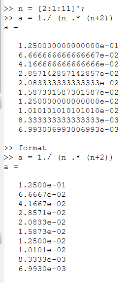

---
## Front matter
lang: ru-RU
title: Лабораторная работа №6
subtitle: Научное программирование
author:
  - Николаев Дмитрий Иванович, НПМмд-02-24
institute:
  - Российский университет дружбы народов имени Патриса Лумумбы, Москва, Россия
date: 5 октября 2024

## i18n babel
babel-lang: russian
babel-otherlangs: english

## Formatting pdf
toc: false
toc-title: Содержание
slide_level: 2
aspectratio: 169
section-titles: true
theme: metropolis
header-includes:
 - \metroset{progressbar=frametitle,sectionpage=progressbar,numbering=fraction}
 - '\makeatletter'
 - '\beamer@ignorenonframefalse'
 - '\makeatother'
---

# Прагматика выполнения

- Повышение навыков владения Octave;
- Повышение навыков владения Julia;
- Применение полученных знаний на практике в дальнейшем.

# Цели

- Исследование пределов последовательностей, суммирования рядов, численного интегрирования и аппроксимации интегралов с использованием методов программирования на языках **Octave** и **Julia**.

# Задачи

1. Вычисление пределов последовательностей.
2. Нахождение частичных сумм рядов.
3. Численное интегрирование функций.
4. Аппроксимирование интегралов методом средней точки.
5. Сравнение производительности традиционного и векторизованного кода.

# Выполнение работы

## Octave. Предел последовательности

{#fig:001 width=70%}

## Octave. Элементы последовательности

{#fig:002 width=70%}

## Octave. Частичные суммы

{#fig:003 width=70%}

## Octave. Графики элементов последовательности и её частичные суммы

{#fig:graph1 width=70%}

## Octave. Сумма первых 1000 членов гармонического ряда

{#fig:004 width=70%}

## Octave. Вычисление интеграла с помощью встроенной функции

{#fig:005 width=70%}

## Octave. Вычисления интеграла с помощью циклов

{#fig:006 width=70%}

## Octave. Результат вычисления интеграла с помощью циклов

{#fig:007 width=70%}

## Octave. Вычисления интеграла с помощью векторизированных операций

{#fig:008 width=70%}

## Octave. Результат вычисления интеграла с помощью векторизированных операций

{#fig:009 width=70%}

## Octave. Сравнение времени вычисления интеграла с помощью циклов и векторизированных операций

{#fig:010 width=70%}

## Julia. Вычисление предела, членов ряда, частичных сумм и интегралов

{#fig:011 width=70%}

## Julia. Графики элементов последовательности и её частичные суммы

{#fig:graph2 width=70%}

## Julia. Вычисления интеграла с помощью циклов и векторизированных операций

{#fig:012 width=70%}

## Julia. Сравнение времени вычисления интеграла с помощью циклов и векторизированных операций

{#fig:013 width=70%}

# Результаты

По результатам работы, я реализовал вычисление пределов последовательностей, суммирование рядов, численное интегрирование и аппроксимацию интегралов с использованием циклов и векторизированных операций на языках Octave и Julia.
