---
## Front matter
title: "Лабораторная работа №6"
subtitle: "Научное программирование"
author: "Николаев Дмитрий Иванович, НПМмд-02-24"

## Generic otions
lang: ru-RU
toc-title: "Содержание"

## Bibliography
bibliography: bib/cite.bib
csl: pandoc/csl/gost-r-7-0-5-2008-numeric.csl

## Pdf output format
toc: true # Table of contents
toc-depth: 2
lof: true # List of figures
lot: true # List of tables
fontsize: 12pt
linestretch: 1.5
papersize: a4
documentclass: scrreprt
## I18n polyglossia
polyglossia-lang:
  name: russian
  options:
	- spelling=modern
	- babelshorthands=true
polyglossia-otherlangs:
  name: english
## I18n babel
babel-lang: russian
babel-otherlangs: english
## Fonts
mainfont: PT Serif
romanfont: PT Serif
sansfont: PT Sans
monofont: PT Mono
mainfontoptions: Ligatures=TeX
romanfontoptions: Ligatures=TeX
sansfontoptions: Ligatures=TeX,Scale=MatchLowercase
monofontoptions: Scale=MatchLowercase,Scale=0.9
## Biblatex
biblatex: true
biblio-style: "gost-numeric"
biblatexoptions:
  - parentracker=true
  - backend=biber
  - hyperref=auto
  - language=auto
  - autolang=other*
  - citestyle=gost-numeric
## Pandoc-crossref LaTeX customization
figureTitle: "Рис."
tableTitle: "Таблица"
listingTitle: "Листинг"
lofTitle: "Список иллюстраций"
lotTitle: "Список таблиц"
lolTitle: "Листинги"
## Misc options
indent: true
header-includes:
  - \usepackage{indentfirst}
  - \usepackage{float} # keep figures where there are in the text
  - \floatplacement{figure}{H} # keep figures where there are in the text
---

# Цель работы

Цель данной лабораторной работы заключается в исследовании пределов последовательностей, суммирования рядов, численного интегрирования и аппроксимации интегралов с использованием методов программирования на языках **Octave** и **Julia**.

# Теоретическое введение

- **Пределы последовательностей**: Предел последовательности --- это значение, к которому стремятся элементы последовательности при стремлении индекса к бесконечности. Например, известный предел

    $$
    \lim_{n \to \infty} \left(1 + \frac{1}{n}\right)^n = e.
    $$
  
- **Ряды и частичные суммы**: Ряд --- это бесконечная сумма элементов последовательности, частичная сумма --- это сумма конечного количества членов ряда.

- **Численное интегрирование**: Методы численного интегрирования включают различные техники для аппроксимации значений интегралов, такие как правило средней точки, трапеций и правило Симпсона.

Методы, используемые в данной лабораторной работе, основываются на численных алгоритмах, которые широко применяются для решения задач, где аналитические методы являются сложными или невозможными.

# Выполнение лабораторной работы

Следуя указаниям из [-@lab6], выполним лабораторную работу на Octave и Julia.

## Octave

### Предел последовательности

Вычислим предел последовательности
$$\lim_{n \to \infty} \left(1 + \frac{1}{n}\right)^n
$$
для различных значений $n$ ([@fig:001]).

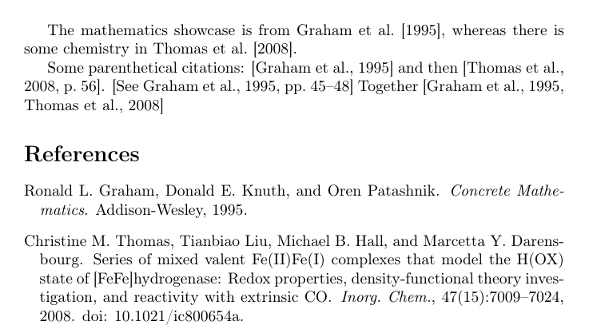{#fig:001 width=70%}

### Частичные суммы ряда

Рассмотрим ряд
$$
a_n = \frac{1}{n(n+2)}
$$
и найдём его элементы ([@fig:002]), частичные суммы ([@fig:003]) и построим их графики ([@fig:graph1]).

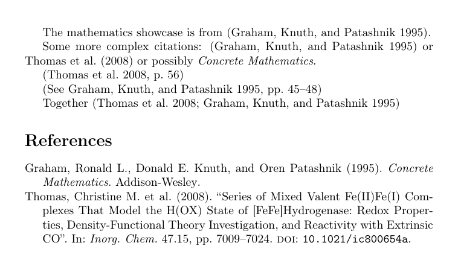{#fig:002 width=70%}

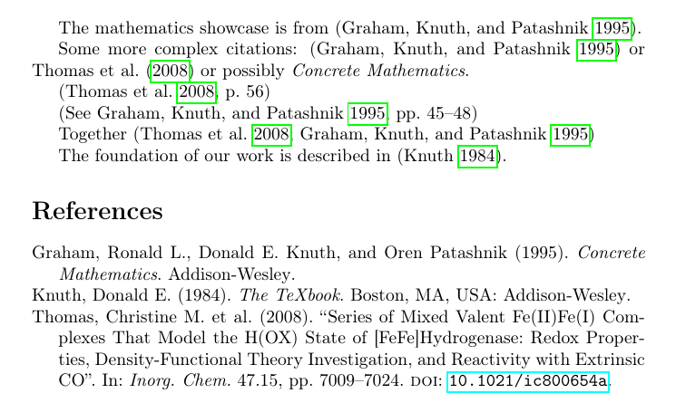{#fig:003 width=70%}

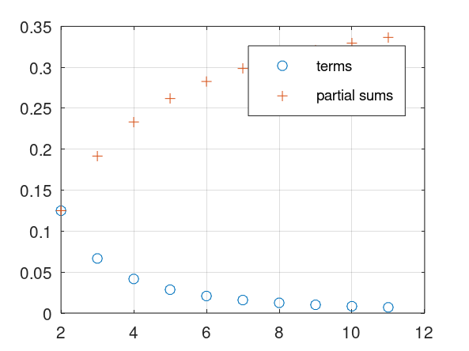{#fig:graph1 width=70%}

### Гармонический ряд

Найдем сумму первых 1000 членов гармонического ряда ([@fig:004]).

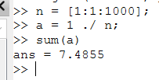{#fig:004 width=70%}

### Численное интегрирование

Вычислим интеграл
$$
\int_0^{\frac{\pi}{2}} e^{x^2} \cos(x) \, dx
$$
с помощью встроенной функции `quad` ([@fig:005]).

{#fig:005 width=70%}

### Аппроксимирование методом средней точки

Вычислим интеграл из предыдущего подраздела по правилу средней точки для $n = 100$ ([@fig:006,@fig:007]).

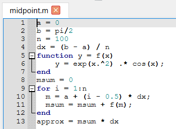{#fig:006 width=70%}

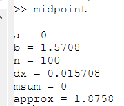{#fig:007 width=70%}

### Векторизованное вычисление методом средней точки

Теперь вычислим интеграл по правилу средней точки с помощью векторизированных операций для $n = 100$ ([@fig:008,@fig:009]).

{#fig:008 width=70%}

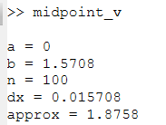{#fig:009 width=70%}

### Сравнение времени выполнения

Сравним время выполнения традиционного и векторизованного кода ([@fig:010]). Как видим код на основе векторизированных операций выполняется примерно в 2 раза быстрее.

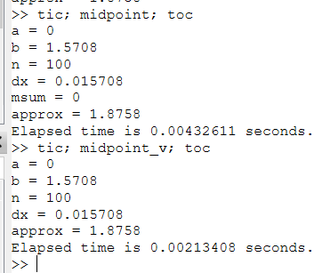{#fig:010 width=70%}

## Julia

Реализуем вычисление предела, членов ряда, частичных сумм и вычисление интеграла с помощью пакета `QuadGK` ([@fig:011]). После чего построим график членов ряда и его частичных сумм ([@fig:graph2]). Далее реализуем вычисление интеграла методом средней точки с помощью циклов и векторизированных операций ([@fig:012]), в результате мы не наблюдаем существенного ускорения во времени вычисления интеграла ([@fig:013]).

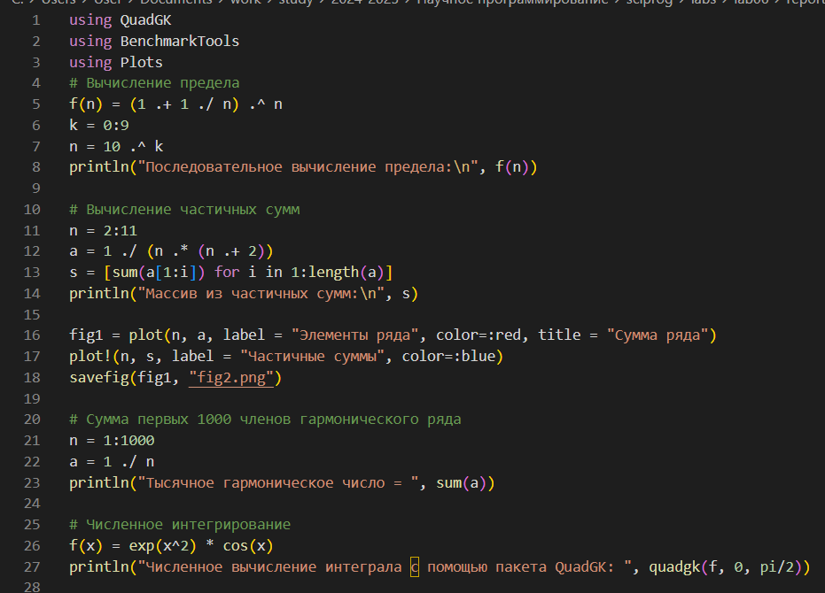{#fig:011 width=70%}

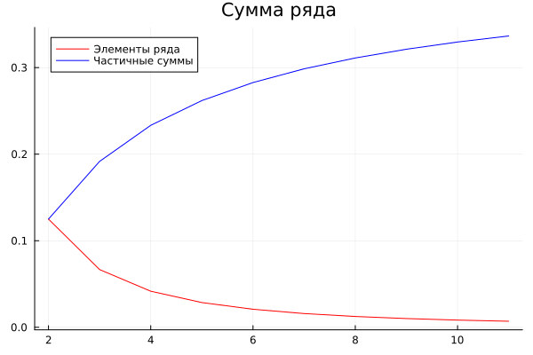{#fig:graph2 width=70%}

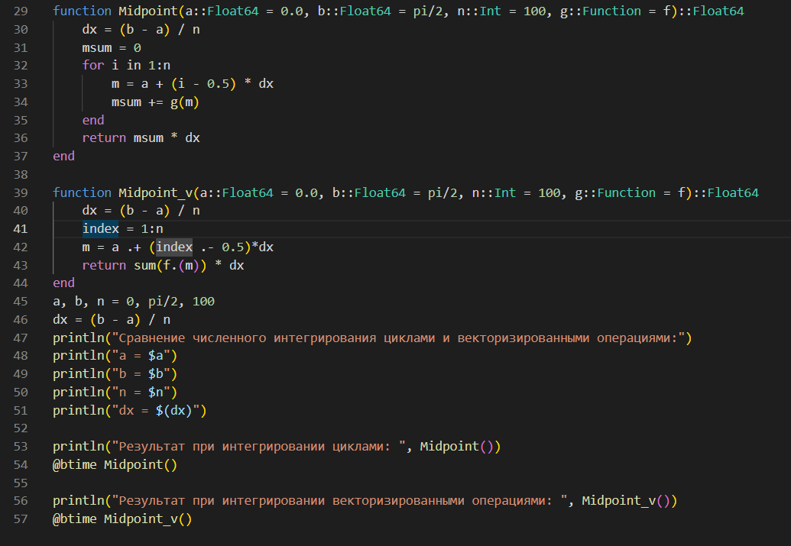{#fig:012 width=70%}

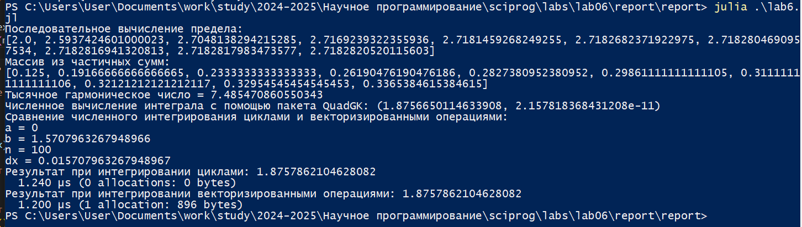{#fig:013 width=70%}

# Выводы

В ходе выполнения лабораторной работы я реализовал вычисление пределов последовательностей, суммирование рядов, численное интегрирование и аппроксимацию интегралов с использованием циклов и векторизированных операций на языках Octave и Julia.

# Список литературы{.unnumbered}

::: {#refs}
:::
