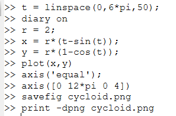

---
## Front matter
lang: ru-RU
title: Лабораторная работа №2. Создание первого документа в LaTeX
subtitle: Computer Skills for Scientific Writing
author:
  - Николаев Дмитрий Иванович, НПМмд-02-24
institute:
  - Российский университет дружбы народов имени Патриса Лумумбы, Москва, Россия
date: 22 сентября 2025

## i18n babel
babel-lang: russian
babel-otherlangs: english

## Formatting pdf
toc: false
toc-title: Содержание
slide_level: 2
aspectratio: 169
section-titles: true
theme: metropolis
header-includes:
 - \metroset{progressbar=frametitle,sectionpage=progressbar,numbering=fraction}
 - '\makeatletter'
 - '\beamer@ignorenonframefalse'
 - '\makeatother'
---

# Прагматика выполнения

- Освоение базового синтаксиса и структуры LaTeX-документа.
- Получение навыков компиляции исходного кода в готовый PDF-файл.
- Формирование фундамента для создания более сложных научных документов.

# Цели

Изучить и применить на практике основные этапы жизненного цикла документа в LaTeX: от создания исходного `.tex`-файла до его модификации и получения итогового PDF-документа.

# Задачи

1. Создать базовый LaTeX-документ с минимальной структурой.
2. Выполнить компиляцию файла с помощью `pdflatex` и проверить результат.
3. Модифицировать документ: добавить опции, новый текст, сноску и специальные символы.
4. Выполнить финальную компиляцию и убедиться в корректном отображении всех изменений.

# Выполнение работы

## 1. Создание базового документа

Был создан файл `lab2.tex` со следующим содержанием:

```latex
\documentclass{article}
\usepackage[T1]{fontenc}
\begin{document}
Hey world!
This is a first document.
\end{document}
```

Компиляция производилась командой `pdflatex lab2.tex`.

## 2. Результат первой компиляции

{#fig:001 width=70%}

## 3. Модификация документа

В исходный файл были внесены следующие изменения:

- Добавлены опции документа: `[a4paper,12pt]`.
- Добавлена поддержка русского языка и новый текст.
- Вставлена сноска командой `\footnote{}`.
- Добавлены специальные символы: `\$`, `\&`, `\%`, `\#`, `\_`.
- Использован неразрывный пробел (`~`).

## 4. Итоговый код `lab2.tex`

```latex
\documentclass[a4paper,12pt]{article}
\usepackage[T1]{fontenc}
\usepackage[utf8]{inputenc}
\usepackage[russian]{babel}

\begin{document}
Hey world! This is a first document.

Это первый абзац... LaTeX -- это мощная система верстки\footnote{И не только!}.

Второй абзац... нужно экранировать символы: \$, \&, \%, \#, \_. 
...имя великого поэта А.~С.~Пушкина.
\end{document}
```

## 5. Финальный результат

{#fig:002 width=70%}

# Результаты

По итогам работы был успешно создан, скомпилирован и модифицирован документ LaTeX.

- Освоен базовый синтаксис и структура `.tex` файла.
- Получен практический опыт работы с компилятором `pdflatex`.
- Изучены команды для добавления сносок, специальных символов и управления переносами строк.
- Рабочее окружение и полученные навыки полностью готовы для выполнения более сложных задач.
