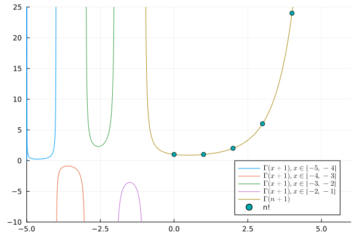

---
## Front matter
lang: ru-RU
title: Лабораторная работа №7
subtitle: Научное программирование
author:
  - Николаев Дмитрий Иванович, НПМмд-02-24
institute:
  - Российский университет дружбы народов имени Патриса Лумумбы, Москва, Россия
date: 5 октября 2024

## i18n babel
babel-lang: russian
babel-otherlangs: english

## Formatting pdf
toc: false
toc-title: Содержание
slide_level: 2
aspectratio: 169
section-titles: true
theme: metropolis
header-includes:
 - \metroset{progressbar=frametitle,sectionpage=progressbar,numbering=fraction}
 - '\makeatletter'
 - '\beamer@ignorenonframefalse'
 - '\makeatother'
---

# Прагматика выполнения

- Повышение навыков владения Octave;
- Повышение навыков владения Julia;
- Применение полученных знаний на практике в дальнейшем.

# Цели

Изучение методов вычислений и визуализации на языках программирования Octave и Julia.

# Задачи

1. Построение параметрических и полярных графиков.
2. Работа с неявными функциями и вычисление касательных.
3. Выполнение операций с комплексными числами.
4. Использование специальных функций, таких как гамма--функция.

# Выполнение работы

## Octave. Построение параметрических графиков (1/2)

{#fig:001 width=70%}

## Octave. Построение параметрических графиков (2/2)

{#fig:cycloid width=70%}

## Octave. Построение графиков в полярных координатах (1/2)

{#fig:002 width=70%}

## Octave. Построение графиков в полярных координатах (2/2)

{#fig:003 width=70%}

## Octave. График улитки Паскаля в декартовых координатах

{#fig:limacon width=70%}

## Octave. График улитки Паскаля в полярных координатах

{#fig:limaconpolar width=70%}

## Octave. Построение неявных функций (1/2)

{#fig:004 width=70%}

## Octave. Построение неявных функций (2/2)

{#fig:impl1 width=70%}

## Octave. Построение неявно заданной окружности (1/2)

{#fig:005 width=70%}

## Octave. Построение неявно заданной окружности (2/2)

{#fig:impl2 width=70%}

## Octave. Операции с комплексными числами (1/3)

{#fig:006 width=70%}

## Octave. Операции с комплексными числами (2/3)

{#fig:complex width=70%}

## Octave. Операции с комплексными числами (3/3)

{#fig:007 width=70%}

## Octave. Специальные функции (1/4)

{#fig:003 width=70%}

## Octave. Специальные функции (2/4)

{#fig:gamma width=70%}

## Octave. Специальные функции (3/4)

{#fig:009 width=70%}

## Octave. Специальные функции (4/4)

{#fig:gamma2 width=70%}

## Julia. Построение параметрических графиков (1/2)

{#fig:010 width=70%}

## Julia. Построение параметрических графиков (2/2)

{#fig:graph1 width=70%}

## Julia. Построение графиков в полярных координатах (1/2)

{#fig:011 width=70%}

## Julia. Построение графиков в полярных координатах (2/2)

{#fig:graph2 width=70%}

## Julia. Построение неявных функций (1/3)

{#fig:012 width=70%}

## Julia. Построение неявных функций (2/3)

{#fig:graph3 width=70%}

## Julia. Построение неявных функций (3/3)

{#fig:graph4 width=70%}

## Julia. Операции с комплексными числами (1/2)

{#fig:013 width=70%}

## Julia. Операции с комплексными числами (2/2)

{#fig:014 width=70%}

## Julia. Специальные функции (1/3)

{#fig:015 width=70%}

## Julia. Специальные функции (2/3)

{#fig:graph5 width=70%}

## Julia. Специальные функции (3/3)

{#fig:graph6 width=70%}

# Результаты

По результатам работы, я изучил методы вычислений и визуализации на языках программирования Octave и Julia.
