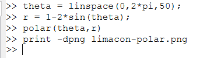
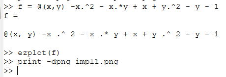
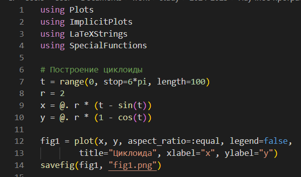
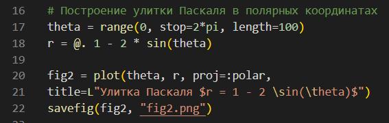

---
## Front matter
title: "Лабораторная работа №7"
subtitle: "Научное программирование"
author: "Николаев Дмитрий Иванович, НПМмд-02-24"

## Generic otions
lang: ru-RU
toc-title: "Содержание"

## Bibliography
bibliography: bib/cite.bib
csl: pandoc/csl/gost-r-7-0-5-2008-numeric.csl

## Pdf output format
toc: true # Table of contents
toc-depth: 2
lof: true # List of figures
lot: true # List of tables
fontsize: 12pt
linestretch: 1.5
papersize: a4
documentclass: scrreprt
## I18n polyglossia
polyglossia-lang:
  name: russian
  options:
	- spelling=modern
	- babelshorthands=true
polyglossia-otherlangs:
  name: english
## I18n babel
babel-lang: russian
babel-otherlangs: english
## Fonts
mainfont: PT Serif
romanfont: PT Serif
sansfont: PT Sans
monofont: PT Mono
mainfontoptions: Ligatures=TeX
romanfontoptions: Ligatures=TeX
sansfontoptions: Ligatures=TeX,Scale=MatchLowercase
monofontoptions: Scale=MatchLowercase,Scale=0.9
## Biblatex
biblatex: true
biblio-style: "gost-numeric"
biblatexoptions:
  - parentracker=true
  - backend=biber
  - hyperref=auto
  - language=auto
  - autolang=other*
  - citestyle=gost-numeric
## Pandoc-crossref LaTeX customization
figureTitle: "Рис."
tableTitle: "Таблица"
listingTitle: "Листинг"
lofTitle: "Список иллюстраций"
lotTitle: "Список таблиц"
lolTitle: "Листинги"
## Misc options
indent: true
header-includes:
  - \usepackage{indentfirst}
  - \usepackage{float} # keep figures where there are in the text
  - \floatplacement{figure}{H} # keep figures where there are in the text
---

# Цель работы

Целью данной лабораторной работы является изучение методов вычислений и визуализации на языках программирования Octave и Julia.

# Теоретическое введение

В лабораторной работе изучаются различные подходы к построению и анализу графиков с использованием параметрических уравнений, полярных координат, неявных функций и комплексных чисел. Параметрические уравнения дают возможность моделировать кривые через изменение параметра $t$, тогда как полярные координаты часто используются для описания фигур, имеющих осевую симметрию.

Неявные функции представляют собой уравнения, где зависимость между переменными не выражена явно, что требует применения численных методов для построения их графиков. Работа с комплексными числами и вычисление их графиков полезна для моделирования процессов, связанных с векторными величинами.

# Выполнение лабораторной работы

Следуя указаниям из [-@lab7], выполним лабораторную работу на Octave и Julia.

## Octave

### Построение параметрических графиков

Построим график циклоиды радиуса 2 ([@fig:001,@fig:cycloid])
$$
x = r(t - sin(t))
$$
$$
y = r(1 - cos(t))
$$

{#fig:001 width=70%}

{#fig:cycloid width=70%}

### Построение графиков в полярных координатах

Построим график улитки Паскаля $r = 1 - 2 \cdot sin(\theta)$ ([@fig:002,@fig:003]) в обычных ([@fig:limacon]) и полярных координатах ([@fig:limaconpolar])

{#fig:002 width=70%}

{#fig:003 width=70%}

{#fig:limacon width=70%}

{#fig:limaconpolar width=70%}

### Построение неявных функций

Построим график неявно заданной функции ([@fig:004,@fig:impl1])
$$
f(x, y) = -x^2 - x*y + x + y^2 - y - 1
$$
и график окружности с центром в точке $(2, 0)$ радиуса 5 вместе с касательной в точке $(-1, 4)$ ([@fig:005,@fig:impl2])

{#fig:004 width=70%}

{#fig:impl1 width=70%}

{#fig:005 width=70%}

{#fig:impl2 width=70%}

### Операции с комплексными числами

Проверим простейшие операции с комплексными числами ([@fig:006]) и отобразим их в виде векторов на графике ([@fig:complex]).

{#fig:006 width=70%}

{#fig:complex width=70%}

Заметим, что действия с дробной степенью отрицательных чисел как результат даёт число с наименьшим аргументом (углом) комплексного числа ([@fig:007]).

{#fig:007 width=70%}

### Специальные функции

Построим график факториала и гамма-функции вместе с вертикальными асимптотами ([@fig:008,@fig:gamma]) и без ([@fig:009,@fig:gamma2]).

{#fig:003 width=70%}

{#fig:gamma width=70%}

{#fig:009 width=70%}

{#fig:gamma2 width=70%}

## Julia

Повторим предыдущие задания на языке Julia. Построим циклоиду ([@fig:010,@fig:graph1]), улитку Паскаля ([@fig:011,@fig:graph2]), неявно заданную функцию $f(x, y) = -x^2 - x*y + x + y^2 - y - 1$ и окружность со своей касательной ([@fig:012,@fig:graph3,@fig:graph4]), проверим операции с комплексными числами ([@fig:013,@fig:014]), а также построим факториал и гамма-функцию ([@fig:015]) вместе с вертикальными ассимптотами ([@fig:graph5]) и без ([@fig:graph5]).

{#fig:010 width=70%}

{#fig:graph1 width=70%}

{#fig:011 width=70%}

{#fig:graph2 width=70%}

{#fig:012 width=70%}

{#fig:graph3 width=70%}

{#fig:graph4 width=70%}

{#fig:013 width=70%}

{#fig:014 width=70%}

{#fig:015 width=70%}

{#fig:graph5 width=70%}

{#fig:graph6 width=70%}

# Выводы

В ходе выполнения лабораторной работы я изучил методы вычислений и визуализации на языках программирования Octave и Julia.

# Список литературы{.unnumbered}

::: {#refs}
:::
