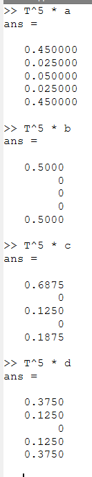
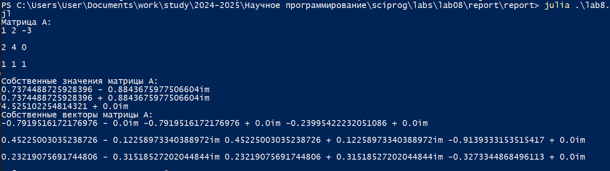

---
## Front matter
lang: ru-RU
title: Лабораторная работа №8
subtitle: Научное программирование
author:
  - Николаев Дмитрий Иванович, НПМмд-02-24
institute:
  - Российский университет дружбы народов имени Патриса Лумумбы, Москва, Россия
date: 6 октября 2024

## i18n babel
babel-lang: russian
babel-otherlangs: english

## Formatting pdf
toc: false
toc-title: Содержание
slide_level: 2
aspectratio: 169
section-titles: true
theme: metropolis
header-includes:
 - \metroset{progressbar=frametitle,sectionpage=progressbar,numbering=fraction}
 - '\makeatletter'
 - '\beamer@ignorenonframefalse'
 - '\makeatother'
---

# Прагматика выполнения

- Повышение навыков владения Octave;
- Повышение навыков владения Julia;
- Применение полученных знаний на практике в дальнейшем.

# Цели

Целью работы является изучение собственных значений и собственных векторов матриц, а также моделирование цепей Маркова на языках программирования Octave и Julia.

# Задачи

1. Нахождение собственных значений и векторов матриц;
2. Анализ случайного блуждания с использованием цепей Маркова;
3. Вычисление равновесных состояний цепей Маркова.

# Выполнение работы

## Octave. Собственные значения и векторы (1/2)

{#fig:001 width=70%}

## Octave. Собственные значения и векторы (2/2)

{#fig:002 width=70%}

## Octave. Цепи Маркова: Случайное блуждание (1/2)

{#fig:003 width=70%}

## Octave. Цепи Маркова: Случайное блуждание (2/2)

{#fig:004 width=70%}

## Octave. Цепи Маркова: Равновесное состояние (1/2)

{#fig:005 width=70%}

## Octave. Цепи Маркова: Равновесное состояние (2/2)

{#fig:006 width=70%}

## Julia. Собственные значения и векторы (1/2)

{#fig:007 width=70%}

## Julia. Собственные значения и векторы (2/2)

{#fig:008 width=70%}

## Julia. Собственные значения и векторы симметричной матрицы (1/2)

{#fig:009 width=70%}

## Julia. Собственные значения и векторы симметричной матрицы (2/2)

{#fig:010 width=70%}

## Julia. Цепи Маркова: Случайное блуждание (1/2)

{#fig:011 width=70%}

## Julia. Цепи Маркова: Случайное блуждание (2/2)

{#fig:012 width=70%}

## Julia. Цепи Маркова: Равновесное состояние (1/2)

{#fig:013 width=70%}

## Julia. Цепи Маркова: Равновесное состояние (2/2)

{#fig:014 width=70%}

# Результаты

По результатам работы, я изучил возможности вычисления собственных значений и собственных векторов матриц, а также моделирования цепей Маркова на языках программирования Octave и Julia.
