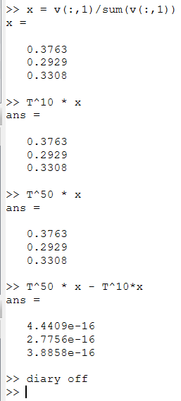

---
## Front matter
title: "Лабораторная работа №8"
subtitle: "Научное программирование"
author: "Николаев Дмитрий Иванович, НПМмд-02-24"

## Generic otions
lang: ru-RU
toc-title: "Содержание"

## Bibliography
bibliography: bib/cite.bib
csl: pandoc/csl/gost-r-7-0-5-2008-numeric.csl

## Pdf output format
toc: true # Table of contents
toc-depth: 2
lof: true # List of figures
lot: true # List of tables
fontsize: 12pt
linestretch: 1.5
papersize: a4
documentclass: scrreprt
## I18n polyglossia
polyglossia-lang:
  name: russian
  options:
	- spelling=modern
	- babelshorthands=true
polyglossia-otherlangs:
  name: english
## I18n babel
babel-lang: russian
babel-otherlangs: english
## Fonts
mainfont: PT Serif
romanfont: PT Serif
sansfont: PT Sans
monofont: PT Mono
mainfontoptions: Ligatures=TeX
romanfontoptions: Ligatures=TeX
sansfontoptions: Ligatures=TeX,Scale=MatchLowercase
monofontoptions: Scale=MatchLowercase,Scale=0.9
## Biblatex
biblatex: true
biblio-style: "gost-numeric"
biblatexoptions:
  - parentracker=true
  - backend=biber
  - hyperref=auto
  - language=auto
  - autolang=other*
  - citestyle=gost-numeric
## Pandoc-crossref LaTeX customization
figureTitle: "Рис."
tableTitle: "Таблица"
listingTitle: "Листинг"
lofTitle: "Список иллюстраций"
lotTitle: "Список таблиц"
lolTitle: "Листинги"
## Misc options
indent: true
header-includes:
  - \usepackage{indentfirst}
  - \usepackage{float} # keep figures where there are in the text
  - \floatplacement{figure}{H} # keep figures where there are in the text
---

# Цель работы

Целью работы является изучение собственных значений и собственных векторов матриц, а также моделирование цепей Маркова на языках программирования Octave и Julia.

# Теоретическое введение

## Собственные значения и собственные векторы

Собственные значения и собственные векторы играют важную роль в линейной алгебре и математической физике. Для матрицы $A$ уравнение собственных значений записывается как:
$$
A \overrightarrow{v} = \lambda \overrightarrow{v},
$$
где $\lambda$ --- собственное значение, а $\overrightarrow{v}$ --- собственный вектор матрицы $A$. Эти понятия используются для решения задач динамических систем, квантовой механики, обработки сигналов и др.

## Цепи Маркова

Рассмотрим последовательность случайных событий при соблюдении следующих условий:

- конечное число состояний;
- через определённые промежутки времени проводится наблюдение и регистрируется состояние системы;
- вероятность перехода в каждое из состояний или остаться в том же состоянии зависит только от текущего состояния.

Такая система называется **цепью Маркова**. Наша задача --- предсказать вероятности состояний системы.

Цепи Маркова описывают системы, где переход между состояниями определяется вероятностями, зависящими только от текущего состояния. Матрица переходов $P$ описывает вероятность перехода между состояниями, и её можно использовать для предсказания будущих состояний системы. Математически состояние системы через $k$ шагов определяется как:
$$
\overrightarrow{x_k} = P^k \overrightarrow{x_0}
$$
где $\overrightarrow{x_0}$ --- начальный вектор вероятностей. Цепи Маркова применяются в теории вероятностей, экономике, биоинформатике и многих других областях.

# Выполнение лабораторной работы

Следуя указаниям из [-@lab8], выполним лабораторную работу на Octave и Julia.

## Octave

### Собственные значения и векторы

Зададим матрицу $A$:

$$
A = \begin{pmatrix} 1 & 2 & -3 \\ 2 & 4 & 0 \\ 1 & 1 & 1 \end{pmatrix}
$$

Необходимо найти собственные значения и собственные векторы этой матрицы. Для нахождения используется команда `eig` с двумя выходными аргументами. Синтаксис:

```octave
[v, lambda] = eig(A)
```

Первый элемент результата --- матрица, столбцы которой представляют собой собственные векторы, а второй результат --- диагональная матрица с собственными значениями на диагонали.

```octave
A = [1 2 -3; 2 4 0; 1 1 1]
[v, lambda] = eig(A)
```

Результаты ([@fig:001]):

{#fig:001 width=70%}

Для того, чтобы получить матрицу с действительными собственными значениями, мы можем создать симметричную матрицу (имеющую действительные собственные значения) путём умножения (слева) матрицы $A$ на транспонированную матрицу:

```octave
C = A' * A
[v, lambda] = eig(C)
```

Результаты ([@fig:002]):

$$
C = \begin{pmatrix} 6 & 11 & -2 \\ 11 & 21 & -5 \\ -2 & -5 & 10 \end{pmatrix}
$$

$$
v = \begin{pmatrix} 0.876137 & 0.188733 & -0.443581 \\ -0.477715 & 0.216620 & -0.851390 \\ -0.064597 & 0.957839 & 0.279949 \end{pmatrix}
$$
$$
\lambda = \text{diag} \begin{pmatrix} 0.1497 & 0 & 0 \\ 0 & 8.4751 & 0 \\ 0 & 0 & 28.3752 \end{pmatrix}
$$

{#fig:002 width=70%}

Диагональные элементы матрицы $\lambda$ являются собственными значениями, а соответствующие столбцы матрицы $v$ --- собственными векторами. Каждому собственному значению соответствует бесконечное семейство собственных векторов. Типичные собственные векторы, полученные в Octave, нормированы на единицу.

### Цепи Маркова: Случайное блуждание

Модель случайного блуждания была реализована с использованием матрицы переходов $T$ и нескольких начальных состояний ([@fig:003]).

$$
T = \begin{pmatrix}
1 & 0.5 & 0 & 0 & 0 \\ 0 & 0 & 0.5 & 0 & 0 \\ 0 & 0.5 & 0 & 0.5 & 0 \\ 0 & 0 & 0.5 & 0 & 0 \\ 0 & 0 & 0 & 0.5 & 1
\end{pmatrix}.
$$

{#fig:003 width=70%}

Мы хотим предсказать местоположение после $k$ ходов, что делается путём перемножения матрицы переходов $T$. Вектор вероятности после $k$ периодов получается следующим образом:
$$
x_{k} = T^k a.
$$

Пусть $a = (0.2, 0.2, 0.2, 0.2, 0.2)$, $b = (0.5; 0; 0; 0; 0.5)$, $c = (0; 1; 0; 0; 0)$, $d = (0; 0; 1; 0; 0)$. Найдём вектора вероятностей после 5 шагов:

{#fig:004 width=70%}

### Цепи Маркова: Равновесное состояние

Состояние $x$ является равновесным, если $x = T x$. Каждая цепь Маркова имеет хотя бы одно равновесное состояние. Пусть $T$ --- матрица переходов для цепи Маркова, тогда $\lambda = 1$ является собственным значением $T$. Если $x$ --- собственный вектор для $\lambda = 1$ с неотрицательными компонентами, сумма которых равна 1, то $x$ является равновесным состоянием.

Найдём вектор равновесного состояния для матрицы переходов $T$:

$$
T = \begin{pmatrix} 0.48 & 0.51 & 0.14 \\ 0.29 & 0.04 & 0.52 \\ 0.23 & 0.45 & 0.34 \end{pmatrix}
$$
и её собственные значения вместе с собственными векторами ([@fig:005]):

{#fig:005 width=70%}

После нормализации собственного вектора соответствующего $\lambda = 1$, получим

$$
x = \begin{pmatrix} 0.3763 \\ 0.2929 \\ 0.3308 \end{pmatrix}.
$$

Проверим, действительно ли полученныф вектор является равновесным состоянием ([@fig:006]).

{#fig:006 width=70%}

Получили, что вектор $x$ является равновесным состоянием.

## Julia

Повторим вышеописанные шаги на языке Julia. Найдём собственные значения и вектора матрицы $A$ ([@fig:007,@fig:008]) и полученной из неё симметричной матрицы $C = A'A$ ([@fig:009,@fig:010]), вероятностное распределение через 5 шагов при разных начальных состояних ([@fig:011,@fig:012]), а также найдём равновесное состояние цепи Маркова ([@fig:013,@fig:014]).

{#fig:007 width=70%}

{#fig:008 width=70%}

{#fig:009 width=70%}

{#fig:010 width=70%}

{#fig:011 width=70%}

{#fig:012 width=70%}

{#fig:013 width=70%}

{#fig:014 width=70%}

# Выводы

В ходе выполнения лабораторной работы я изучил возможности вычисления собственных значений и собственных векторов матриц, а также моделирования цепей Маркова на языках программирования Octave и Julia.

# Список литературы{.unnumbered}

::: {#refs}
:::
